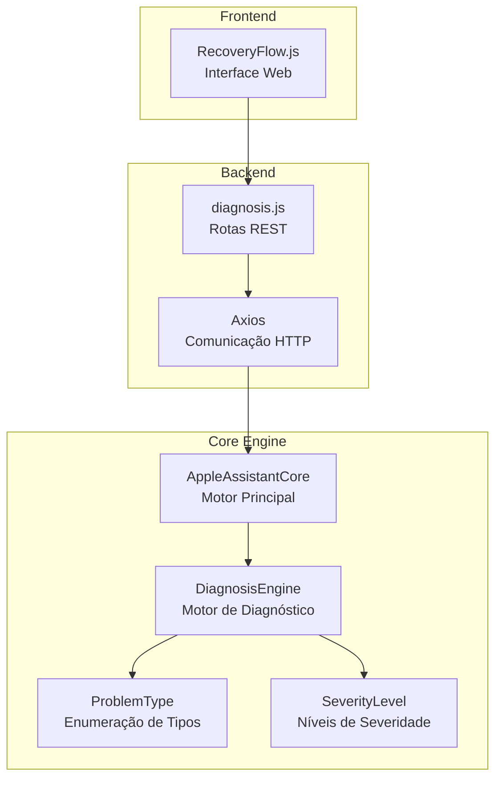
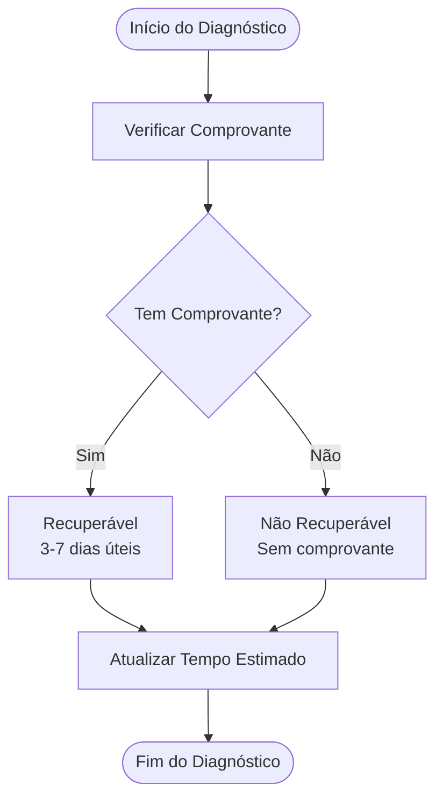
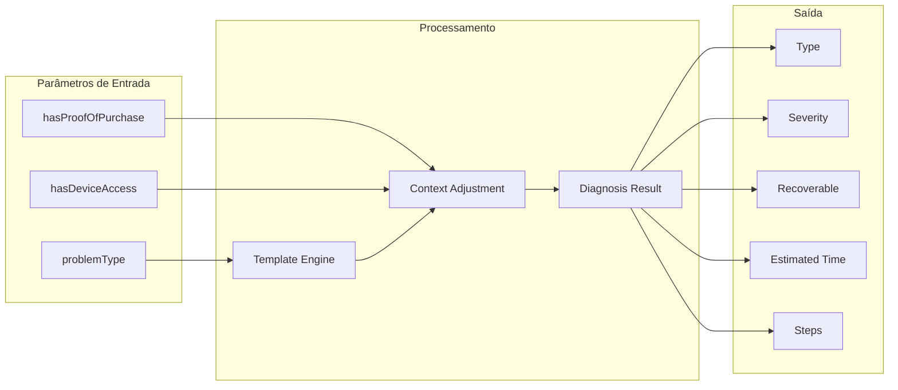
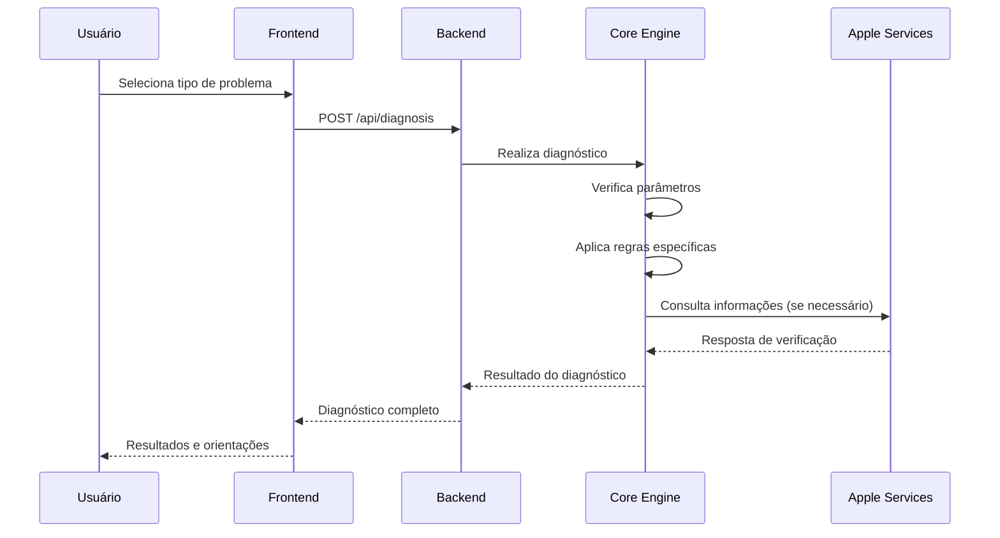

# Tipos de Problemas Suportados

<cite>
**Arquivos Referenciados neste Documento**
- [diagnosis.js](file://backend/src/routes/diagnosis.js)
- [main.py](file://core-engine/python/main.py)
- [api.py](file://core-engine/bridge/api.py)
- [RecoveryFlow.js](file://frontend/src/pages/RecoveryFlow.js)
- [README.md](file://README.md)
</cite>

## Sumário
Este documento apresenta uma análise detalhada dos tipos de problemas suportados pelo sistema de diagnóstico, incluindo suas características específicas, níveis de severidade, impactos no processo de recuperação e como cada tipo é tratado pelo motor de diagnóstico.

## Visão Geral do Sistema

O sistema de diagnóstico é composto por três camadas principais:

**Diagrama Fonte**
- [diagnosis.js:15-69](file://backend/src/routes/diagnosis.js#L15-L69)
- [api.py:206-238](file://core-engine/bridge/api.py#L206-L238)
- [main.py:75-195](file://core-engine/python/main.py#L75-L195)

## Tipos de Problemas Suportados

### 1. Senha Esquecida (forgot-password)

**Características Principais:**
- **Nível de Severidade:** Baixo
- **Recuperabilidade:** Alta
- **Necessita de Suporte Apple:** Não
- **Tempo Estimado:** 15-30 minutos

**Tratamento no Motor de Diagnóstico:**
O sistema identifica automaticamente esse problema como de baixa severidade e recomenda o fluxo oficial da Apple para recuperação de senha.

**Condições Especiais:**
- Processo totalmente automatizado
- Não requer comprovante de compra
- Pode ser resolvido com acesso ao e-mail ou telefone cadastrado

**Impactos no Processo de Recuperação:**
- Fluxo rápido e direto
- Sem necessidade de interação humana
- Processo completamente guiado

**Exemplos Práticos:**
- Usuário esqueceu sua senha pessoal
- Troca de dispositivo sem lembrar da senha
- Recuperação após período de inatividade

### 2. Verificação em 2 Etapas (two-factor)

**Características Principais:**
- **Nível de Severidade:** Médio
- **Recuperabilidade:** Alta
- **Necessita de Suporte Apple:** Sim
- **Tempo Estimado:** 1-3 dias

**Tratamento no Motor de Diagnóstico:**
O sistema recomenda verificar dispositivos confiáveis cadastrados e tentar recuperação via número de telefone.

**Condições Especiais:**
- Processo mais demorado devido à segurança adicional
- Requer verificação de identidade adicional
- Pode exigir suporte humano em alguns casos

**Impactos no Processo de Recuperação:**
- Aumento significativo no tempo de resolução
- Necessidade de múltiplas verificações
- Possível interação com suporte da Apple

**Exemplos Práticos:**
- Perda do celular com acesso ao número cadastrado
- Dispositivo confiável não reconhecido
- Problemas com aplicativos de autenticação

### 3. Bloqueio de Ativação (activation-lock)

**Características Principais:**
- **Nível de Severidade:** Alto
- **Recuperabilidade:** Condicional
- **Necessita de Suporte Apple:** Sim
- **Tempo Estimado:** 3-7 dias (com comprovante) / Não recuperável (sem comprovante)

**Tratamento no Motor de Diagnóstico:**
O sistema diferencia dois cenários baseados no parâmetro `has_proof_of_purchase`:

**Condições Especiais:**
- **Comprovante de Compra:** Permite recuperação oficial
- **Sem Comprovante:** Bloqueio permanente
- **Compra Usada:** Necessita de ação imediata com vendedor

**Impactos no Processo de Recuperação:**
- **Comprovante disponível:** Processo legal e seguro
- **Sem comprovante:** Dispositivo inutilizável
- **Compra usada:** Necessidade de ação urgente com vendedor

**Exemplos Práticos:**
- Compra de dispositivo usado sem nota fiscal
- Perda do comprovante de compra original
- Dispositivo adquirido de terceiros com bloqueio ativo

### 4. Conta Inacessível (account-locked)

**Características Principais:**
- **Nível de Severidade:** Médio
- **Recuperabilidade:** Alta
- **Necessita de Suporte Apple:** Sim
- **Tempo Estimado:** 24-48 horas

**Tratamento no Motor de Diagnóstico:**
O sistema recomenda seguir instruções específicas enviadas pelo Apple ID e verificar o motivo do bloqueio.

**Condições Especiais:**
- Geralmente temporário
- Relacionado a tentativas excessivas de login
- Bloqueios de segurança por atividade suspeita

**Impactos no Processo de Recuperação:**
- Processo relativamente rápido
- Necessidade de seguir instruções específicas
- Pode exigir verificação de identidade adicional

**Exemplos Práticos:**
- Conta bloqueada após várias tentativas falhas
- Alertas de segurança ativos
- Suspeita de atividade fraudulenta

### 5. Dispositivo Usado (device-used)

**Características Principais:**
- **Nível de Severidade:** Alto
- **Recuperabilidade:** Geralmente Não
- **Necessita de Suporte Apple:** Sim
- **Tempo Estimado:** Variável / Não garantido

**Tratamento no Motor de Diagnóstico:**
O sistema alerta sobre os riscos e recomenda ações imediatas com o vendedor.

**Condições Especiais:**
- **ALERTA CRÍTICO:** Dispositivos com Activation Lock de terceiros são inutilizáveis
- Necessita de ação imediata com vendedor
- Possíveis ações legais se for golpe

**Impactos no Processo de Recuperação:**
- **Risco Financeiro:** Possível perda total do dispositivo
- **Risco Legal:** Pode envolver golpes comerciais
- **Tempo Incerto:** Sem garantia de solução

**Exemplos Práticos:**
- Compra de iPhone usado sem verificação do iCloud
- Dispositivo com histórico de propriedade limpo
- Compra em mercados livres sem documentação

## Parâmetros de Entrada e Influência

### Parâmetros do Diagnóstico

| Parâmetro | Tipo | Padrão | Descrição |
|-----------|------|--------|-----------|
| `sessionId` | UUID | Obrigatório | Identificador único da sessão de usuário |
| `problemType` | String | Obrigatório | Tipo de problema (um dos 5 suportados) |
| `hasProofOfPurchase` | Boolean | false | Indica se possui comprovante de compra |
| `hasDeviceAccess` | Boolean | false | Indica se tem acesso físico ao dispositivo |

### Impacto dos Parâmetros

**Fonte do Diagrama**
- [main.py:152-195](file://core-engine/python/main.py#L152-L195)

## Níveis de Severidade

O sistema utiliza uma hierarquia de severidade para categorizar os problemas:

| Nível | Cor | Descrição | Impacto Esperado |
|-------|-----|-----------|------------------|
| **Baixo** | Verde | Problemas simples e rápidos de resolver | Menor impacto no tempo de recuperação |
| **Médio** | Amarelo | Problemas moderadamente complexos | Impacto médio no tempo de resolução |
| **Alto** | Vermelho | Problemas críticos com alto impacto | Maior impacto e riscos associados |

## Fluxo de Diagnóstico Detalhado

**Fonte do Diagrama**
- [diagnosis.js:26-69](file://backend/src/routes/diagnosis.js#L26-L69)
- [api.py:206-238](file://core-engine/bridge/api.py#L206-L238)

## Recomendações Específicas por Tipo

### Para Problemas de Baixa Severidade
- **Senhas Esquecidas:** Processo automático e rápido
- **Ações recomendadas:** Acessar portal oficial e seguir instruções

### Para Problemas de Média Severidade  
- **Verificação em 2 Etapas:** Planejar tempo adicional
- **Contas Inacessíveis:** Seguir instruções específicas do Apple ID

### Para Problemas de Alta Severidade
- **Bloqueio de Ativação:** Priorizar comprovante de compra
- **Dispositivos Usados:** Ação imediata com vendedor
- **Ações recomendadas:** Documentar todas as interações

## Considerações Finais

O sistema de diagnóstico foi projetado para:

1. **Manter conformidade legal** com os processos oficiais da Apple
2. **Minimizar riscos** para usuários e vendedores
3. **Fornecer orientações claras** com base em dados reais
4. **Garantir transparência** sobre possibilidades de recuperação

**Fonte do Diagrama**
- [README.md:7-18](file://README.md#L7-L18)