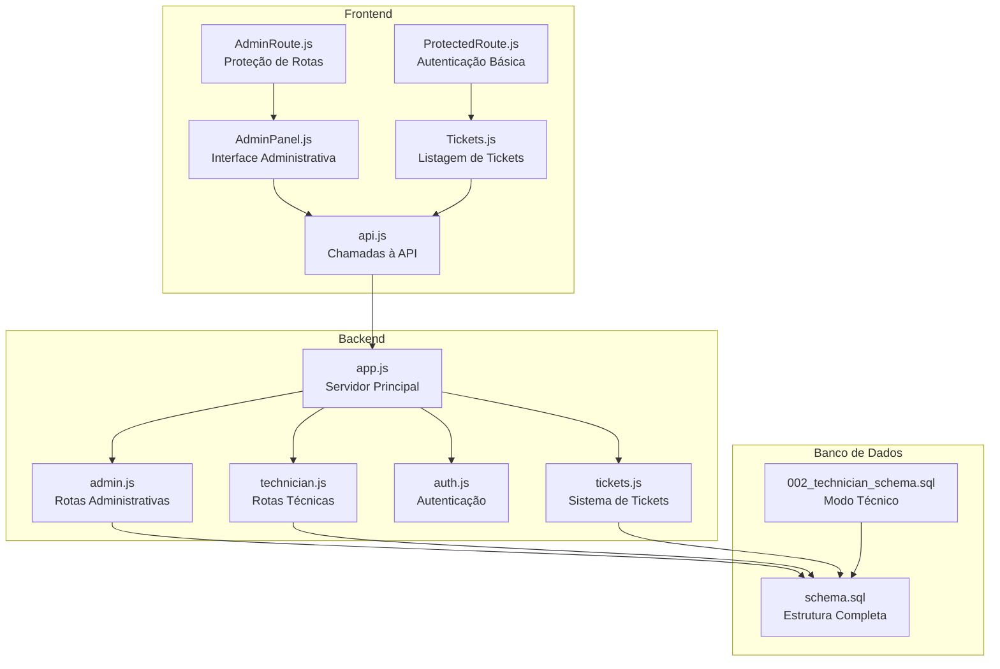
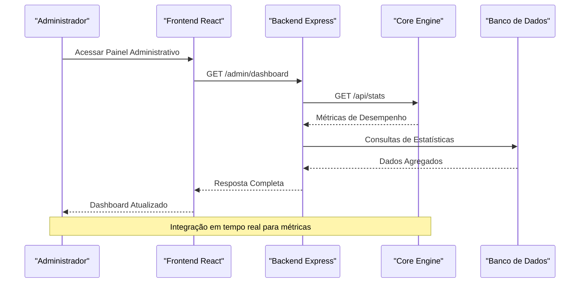
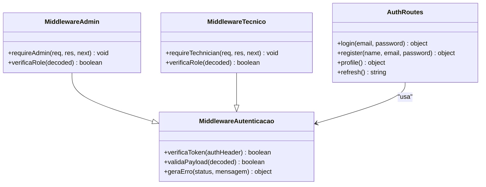
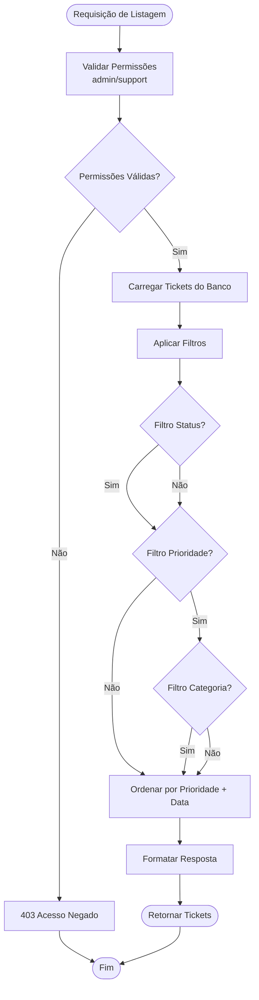
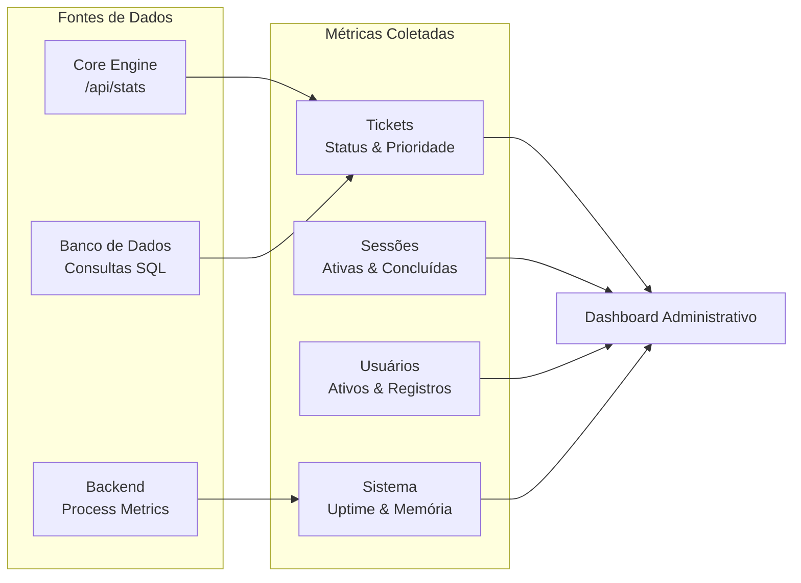
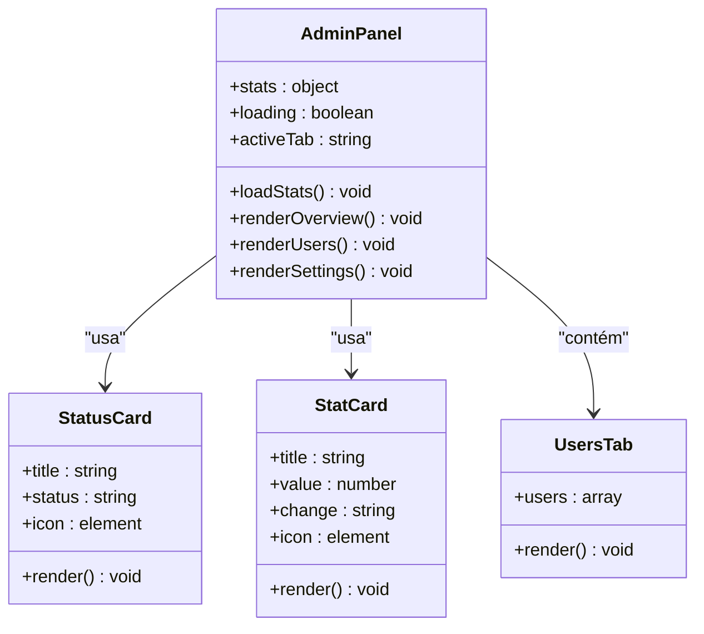
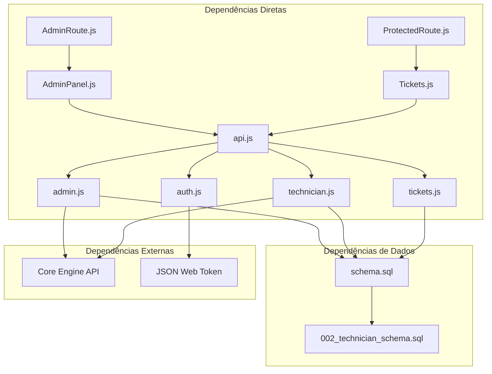

# Funcionalidades Administrativas

<cite>
**Arquivos referenciados neste documento**
- [backend/src/app.js](file://backend/src/app.js)
- [backend/src/routes/admin.js](file://backend/src/routes/admin.js)
- [backend/src/routes/auth.js](file://backend/src/routes/auth.js)
- [backend/src/routes/tickets.js](file://backend/src/routes/tickets.js)
- [backend/src/routes/technician.js](file://backend/src/routes/technician.js)
- [frontend/src/services/api.js](file://frontend/src/services/api.js)
- [frontend/src/pages/AdminPanel.js](file://frontend/src/pages/AdminPanel.js)
- [frontend/src/components/AdminRoute.js](file://frontend/src/components/AdminRoute.js)
- [frontend/src/components/ProtectedRoute.js](file://frontend/src/components/ProtectedRoute.js)
- [frontend/src/pages/Tickets.js](file://frontend/src/pages/Tickets.js)
- [database/schema.sql](file://database/schema.sql)
- [database/migrations/002_technician_schema.sql](file://database/migrations/002_technician_schema.sql)
</cite>

## Sumário
1. [Introdução](#introdução)
2. [Estrutura do Projeto](#estrutura-do-projeto)
3. [Componentes Principais](#componentes-principais)
4. [Visão Geral da Arquitetura](#visão-geral-da-arquitetura)
5. [Análise Detalhada dos Componentes](#análise-detalhada-dos-componentes)
6. [Análise de Dependências](#análise-de-dependências)
7. [Considerações de Desempenho](#considerações-de-desempenho)
8. [Guia de Solução de Problemas](#guia-de-solução-de-problemas)
9. [Conclusão](#conclusão)
10. [Apêndices](#apêndices)

## Introdução
Este documento apresenta as funcionalidades administrativas do sistema de tickets, com foco em:
- Listagem completa de tickets com filtros por status, prioridade e categoria, ordenação avançada e estatísticas de desempenho
- Controle de acesso restrito a administradores e técnicos do suporte, incluindo permissões e validações de autenticação
- Métricas de acompanhamento, relatórios de desempenho e monitoramento do workload do time de suporte
- Exemplos de consultas filtradas, exportação de dados e integração com dashboards de gestão

## Estrutura do Projeto
O sistema é composto por três camadas principais:
- Backend (servidor Express): roteamento, autenticação, validações e integrações
- Frontend (React): interfaces administrativas e de tickets
- Banco de dados (PostgreSQL): persistência de dados com esquema completo

**Diagrama fonte**
- [backend/src/app.js:110-121](file://backend/src/app.js#L110-L121)
- [backend/src/routes/admin.js:14-37](file://backend/src/routes/admin.js#L14-L37)
- [backend/src/routes/technician.js:14-37](file://backend/src/routes/technician.js#L14-L37)
- [backend/src/routes/tickets.js:15-33](file://backend/src/routes/tickets.js#L15-L33)
- [database/schema.sql:8-80](file://database/schema.sql#L8-L80)

**Seção fonte**
- [backend/src/app.js:110-121](file://backend/src/app.js#L110-L121)
- [frontend/src/services/api.js:77-87](file://frontend/src/services/api.js#L77-L87)

## Componentes Principais
As funcionalidades administrativas são implementadas através de:
- Roteamento restrito para administradores
- Middleware de autenticação JWT
- Validações de entrada robustas
- Integrações com o Core Engine
- Interfaces de dashboard e relatórios

**Seção fonte**
- [backend/src/routes/admin.js:14-37](file://backend/src/routes/admin.js#L14-L37)
- [backend/src/routes/auth.js:25-42](file://backend/src/routes/auth.js#L25-L42)
- [backend/src/routes/tickets.js:252-304](file://backend/src/routes/tickets.js#L252-L304)

## Visão Geral da Arquitetura
A arquitetura segue um padrão de microserviços com backend Express e frontend React, conectados ao Core Engine para métricas de desempenho.

**Diagrama fonte**
- [backend/src/routes/admin.js:39-64](file://backend/src/routes/admin.js#L39-L64)
- [backend/src/app.js:110-121](file://backend/src/app.js#L110-L121)

**Seção fonte**
- [backend/src/routes/admin.js:39-64](file://backend/src/routes/admin.js#L39-L64)
- [backend/src/app.js:110-121](file://backend/src/app.js#L110-L121)

## Análise Detalhada dos Componentes

### Controle de Acesso e Autenticação
O sistema implementa um sistema hierárquico de permissões com três níveis:
- Administradores (acesso total)
- Técnicos do suporte (acesso limitado)
- Usuários regulares (acesso básico)

**Diagrama fonte**
- [backend/src/routes/auth.js:25-42](file://backend/src/routes/auth.js#L25-L42)
- [backend/src/routes/admin.js:14-37](file://backend/src/routes/admin.js#L14-L37)
- [backend/src/routes/technician.js:14-37](file://backend/src/routes/technician.js#L14-L37)

**Seção fonte**
- [backend/src/routes/auth.js:25-42](file://backend/src/routes/auth.js#L25-L42)
- [backend/src/routes/admin.js:14-37](file://backend/src/routes/admin.js#L14-L37)
- [backend/src/routes/technician.js:14-37](file://backend/src/routes/technician.js#L14-L37)

### Listagem de Tickets com Filtros Avançados
A funcionalidade de listagem de tickets oferece:
- Filtros por status, prioridade e categoria
- Ordenação avançada (prioridade + data)
- Estatísticas de desempenho
- Controles de acesso rigorosos

**Diagrama fonte**
- [backend/src/routes/tickets.js:252-304](file://backend/src/routes/tickets.js#L252-L304)
- [backend/src/routes/tickets.js:306-328](file://backend/src/routes/tickets.js#L306-L328)

**Seção fonte**
- [backend/src/routes/tickets.js:252-304](file://backend/src/routes/tickets.js#L252-L304)
- [backend/src/routes/tickets.js:306-328](file://backend/src/routes/tickets.js#L306-L328)

### Métricas de Desempenho e Estatísticas
O sistema fornece métricas completas de desempenho através de múltiplas fontes:

**Diagrama fonte**
- [backend/src/routes/admin.js:176-205](file://backend/src/routes/admin.js#L176-L205)
- [backend/src/routes/tickets.js:306-328](file://backend/src/routes/tickets.js#L306-L328)
- [database/schema.sql:53-80](file://database/schema.sql#L53-L80)

**Seção fonte**
- [backend/src/routes/admin.js:176-205](file://backend/src/routes/admin.js#L176-L205)
- [backend/src/routes/tickets.js:306-328](file://backend/src/routes/tickets.js#L306-L328)
- [database/schema.sql:53-80](file://database/schema.sql#L53-L80)

### Interface Administrativa
A interface do painel administrativo oferece:
- Dashboard com visão geral do sistema
- Gerenciamento de usuários
- Configurações do sistema
- Logs e auditoria

**Diagrama fonte**
- [frontend/src/pages/AdminPanel.js:15-158](file://frontend/src/pages/AdminPanel.js#L15-L158)
- [frontend/src/pages/AdminPanel.js:160-190](file://frontend/src/pages/AdminPanel.js#L160-L190)

**Seção fonte**
- [frontend/src/pages/AdminPanel.js:15-158](file://frontend/src/pages/AdminPanel.js#L15-L158)
- [frontend/src/pages/AdminPanel.js:160-190](file://frontend/src/pages/AdminPanel.js#L160-L190)

### Exemplos de Consultas Filtradas
Para realizar consultas avançadas nos tickets, utilize os seguintes parâmetros de consulta:

- **Filtros básicos**:
  - `?status=open` - Filtra por status específico
  - `?priority=urgent` - Filtra por prioridade
  - `?category=password` - Filtra por categoria

- **Combinação de filtros**:
  - `?status=in_progress&priority=high` - Tickets em andamento com alta prioridade
  - `?category=device&status=closed` - Dispositivos bloqueados fechados

- **Ordenação avançada**:
  - Por padrão, ordena por prioridade (urgente > alta > média > baixa) e depois por data decrescente

**Seção fonte**
- [backend/src/routes/tickets.js:252-304](file://backend/src/routes/tickets.js#L252-L304)

### Exportação de Dados e Integração com Dashboards
O sistema permite exportação de dados e integração com dashboards através de:
- APIs RESTful padronizadas
- Formatos JSON estruturados
- Integração com Core Engine para métricas em tempo real
- Hooks para integração com ferramentas de BI

**Seção fonte**
- [frontend/src/services/api.js:77-87](file://frontend/src/services/api.js#L77-L87)
- [backend/src/routes/admin.js:39-64](file://backend/src/routes/admin.js#L39-L64)

## Análise de Dependências
O sistema possui dependências críticas entre componentes:

**Diagrama fonte**
- [frontend/src/components/AdminRoute.js:5-17](file://frontend/src/components/AdminRoute.js#L5-L17)
- [frontend/src/components/ProtectedRoute.js:5-13](file://frontend/src/components/ProtectedRoute.js#L5-L13)
- [frontend/src/services/api.js:77-87](file://frontend/src/services/api.js#L77-L87)
- [backend/src/routes/admin.js:12](file://backend/src/routes/admin.js#L12)
- [backend/src/routes/technician.js:12](file://backend/src/routes/technician.js#L12)

**Seção fonte**
- [frontend/src/components/AdminRoute.js:5-17](file://frontend/src/components/AdminRoute.js#L5-L17)
- [frontend/src/components/ProtectedRoute.js:5-13](file://frontend/src/components/ProtectedRoute.js#L5-L13)
- [frontend/src/services/api.js:77-87](file://frontend/src/services/api.js#L77-L87)
- [backend/src/routes/admin.js:12](file://backend/src/routes/admin.js#L12)
- [backend/src/routes/technician.js:12](file://backend/src/routes/technician.js#L12)

## Considerações de Desempenho
- **Indexação otimizada**: Índices criados para campos de busca frequentes (status, assigned_to, created_at)
- **Paginação automática**: Limites máximos de 100 registros por página
- **Caching de métricas**: Dados do Core Engine cacheados para reduzir latência
- **Rate limiting**: Proteção contra excesso de requisições
- **Compression**: Uso de gzip para reduzir tamanho de respostas

## Guia de Solução de Problemas

### Erros Comuns e Soluções
- **401 Token Inválido**: Verifique o cabeçalho Authorization e renove o token
- **403 Acesso Negado**: Confirme o papel do usuário (admin/support)
- **500 Erro Interno**: Verifique logs do servidor e conexão com Core Engine
- **429 Muitas Requisições**: Aguarde o período de rate limiting

### Monitoramento de Desempenho
- **Dashboard de Métricas**: Acesse `/admin/metrics` para informações em tempo real
- **Logs do Sistema**: `/admin/logs` com filtros por nível e data
- **Health Check**: `/health` para verificação de integridade do serviço

**Seção fonte**
- [backend/src/app.js:148-172](file://backend/src/app.js#L148-L172)
- [backend/src/routes/admin.js:120-142](file://backend/src/routes/admin.js#L120-L142)

## Conclusão
O sistema de tickets administrativos oferece uma solução completa para gerenciamento de chamados com:
- Controles de acesso rigorosos e hierárquicos
- Recursos avançados de filtragem e ordenação
- Métricas de desempenho em tempo real
- Interface intuitiva para monitoramento e relatórios
- Capacidade de integração com dashboards e ferramentas de BI

As funcionalidades implementadas atendem às necessidades de monitoramento do workload do time de suporte e fornecem as bases para expansão de recursos administrativos conforme a demanda crescente.

## Apêndices

### Referências de Código
- [backend/src/routes/admin.js](file://backend/src/routes/admin.js): Implementação completa das rotas administrativas
- [backend/src/routes/tickets.js](file://backend/src/routes/tickets.js): Sistema de tickets com filtros e estatísticas
- [frontend/src/pages/AdminPanel.js](file://frontend/src/pages/AdminPanel.js): Interface administrativa completa
- [database/schema.sql](file://database/schema.sql): Esquema completo do banco de dados
- [backend/src/routes/technician.js](file://backend/src/routes/technician.js): Rotas para modo técnico