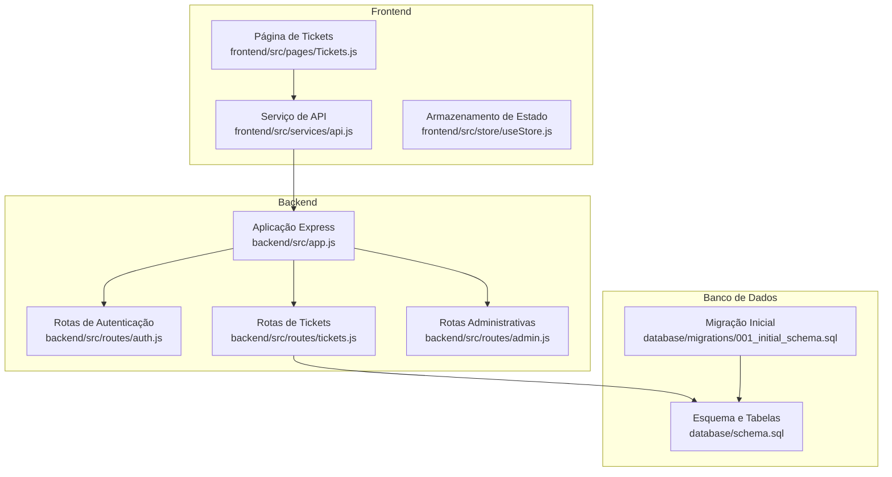
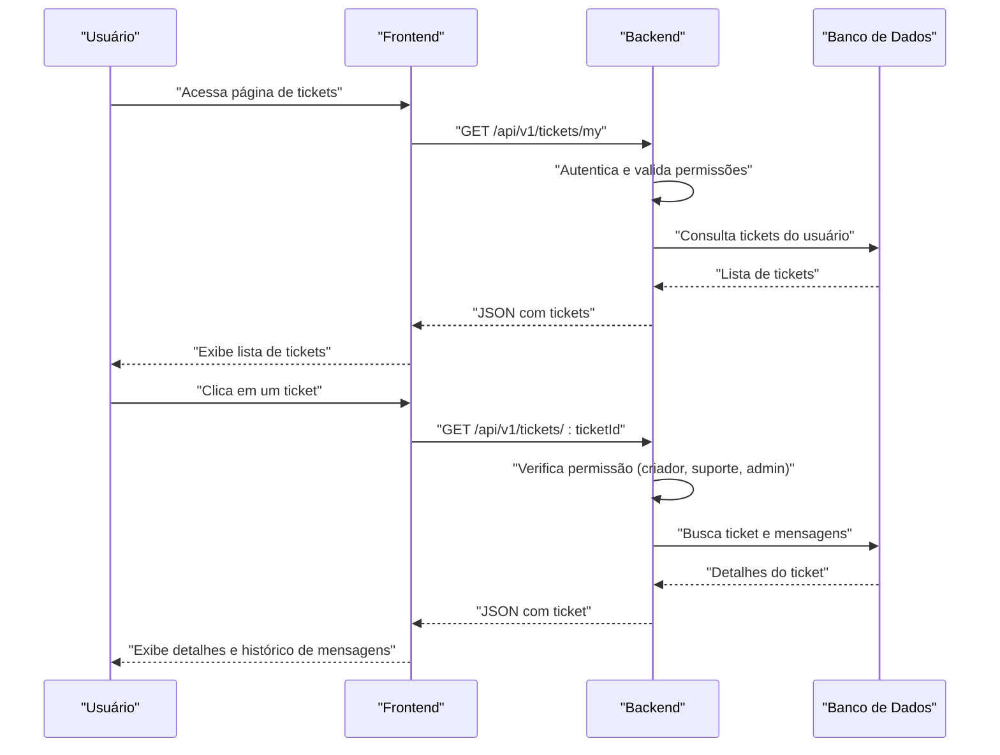
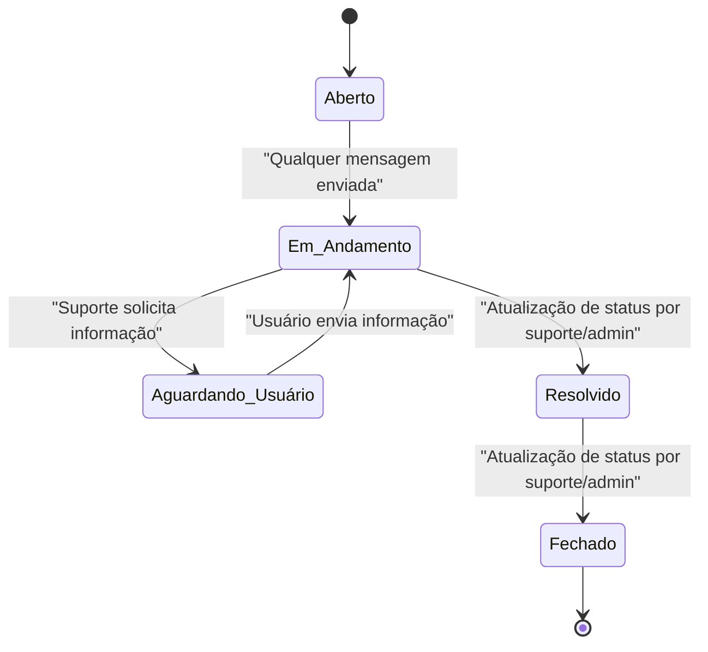
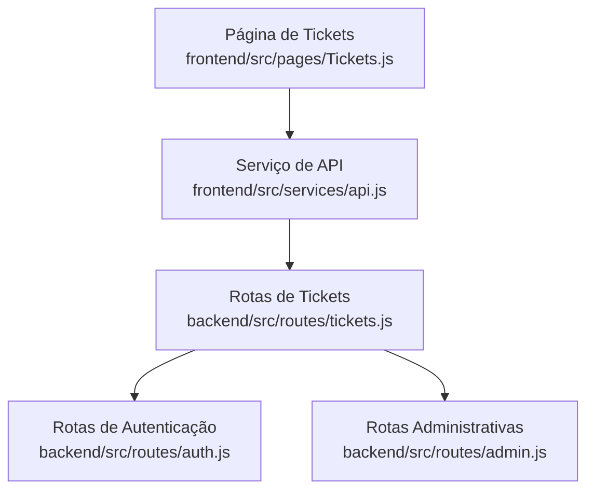

# Gerenciamento de Tickets

<cite>
**Arquivos Referenciados Neste Documento**
- [backend/src/routes/tickets.js](file://backend/src/routes/tickets.js)
- [backend/src/routes/auth.js](file://backend/src/routes/auth.js)
- [backend/src/routes/admin.js](file://backend/src/routes/admin.js)
- [backend/src/app.js](file://backend/src/app.js)
- [frontend/src/pages/Tickets.js](file://frontend/src/pages/Tickets.js)
- [frontend/src/services/api.js](file://frontend/src/services/api.js)
- [frontend/src/store/useStore.js](file://frontend/src/store/useStore.js)
- [database/schema.sql](file://database/schema.sql)
- [database/migrations/001_initial_schema.sql](file://database/migrations/001_initial_schema.sql)
</cite>

## Sumário
- Apresentação geral do sistema de tickets de suporte, incluindo listagem por usuário, consulta detalhada, atualização de status e integração com o sistema de mensagens.
- Definição dos níveis de acesso (usuário comum, suporte, administrador) e suas permissões.
- Fluxo de status dos tickets: aberto, em andamento, aguardando usuário, resolvido e fechado.
- Exemplos de requisições HTTP (GET e PATCH) e validações de permissão.
- Explicação de como o status afeta o fluxo de atendimento e a integração com o frontend.

## Estrutura do Projeto
O sistema de tickets é composto por:
- Backend Express com rotas para autenticação, tickets e administração.
- Frontend React consumindo APIs REST.
- Banco de dados PostgreSQL com tabelas para usuários, sessões e tickets.
- Arquivo de migração inicial que define o esquema do banco de dados.

**Diagrama Fonte**
- [backend/src/app.js:111-121](file://backend/src/app.js#L111-L121)
- [backend/src/routes/tickets.js:1-331](file://backend/src/routes/tickets.js#L1-L331)
- [backend/src/routes/auth.js:1-183](file://backend/src/routes/auth.js#L1-L183)
- [backend/src/routes/admin.js:1-235](file://backend/src/routes/admin.js#L1-L235)
- [frontend/src/pages/Tickets.js:1-359](file://frontend/src/pages/Tickets.js#L1-L359)
- [frontend/src/services/api.js:1-90](file://frontend/src/services/api.js#L1-L90)
- [frontend/src/store/useStore.js:1-53](file://frontend/src/store/useStore.js#L1-L53)
- [database/schema.sql:1-194](file://database/schema.sql#L1-L194)
- [database/migrations/001_initial_schema.sql:1-57](file://database/migrations/001_initial_schema.sql#L1-L57)

**Seção Fonte**
- [backend/src/app.js:111-121](file://backend/src/app.js#L111-L121)
- [database/schema.sql:53-92](file://database/schema.sql#L53-L92)

## Componentes-Chave

### Backend - Rotas de Tickets
- Criação de tickets com validações de assunto, descrição, categoria e prioridade.
- Listagem de tickets do usuário autenticado.
- Consulta detalhada de um ticket com verificação de permissão.
- Adição de mensagens ao ticket com atualização automática de status quando necessário.
- Atualização de status de tickets por usuários com permissões de suporte ou administrador.
- Estatísticas gerais de tickets.

**Seção Fonte**
- [backend/src/routes/tickets.js:52-101](file://backend/src/routes/tickets.js#L52-L101)
- [backend/src/routes/tickets.js:103-123](file://backend/src/routes/tickets.js#L103-L123)
- [backend/src/routes/tickets.js:125-150](file://backend/src/routes/tickets.js#L125-L150)
- [backend/src/routes/tickets.js:152-197](file://backend/src/routes/tickets.js#L152-L197)
- [backend/src/routes/tickets.js:199-250](file://backend/src/routes/tickets.js#L199-L250)
- [backend/src/routes/tickets.js:306-328](file://backend/src/routes/tickets.js#L306-L328)

### Backend - Autenticação e Permissões
- Middleware de autenticação via JWT.
- Validação de credenciais e geração de tokens.
- Verificação de role (user, support, admin) para acesso a rotas restritas.

**Seção Fonte**
- [backend/src/routes/auth.js:25-42](file://backend/src/routes/auth.js#L25-L42)
- [backend/src/routes/auth.js:97-143](file://backend/src/routes/auth.js#L97-L143)
- [backend/src/routes/admin.js:14-37](file://backend/src/routes/admin.js#L14-L37)

### Frontend - Integração com API
- Consumo das rotas de tickets via serviço Axios.
- Exibição de lista de tickets e detalhes.
- Envio de mensagens e navegação entre telas.

**Seção Fonte**
- [frontend/src/services/api.js:68-75](file://frontend/src/services/api.js#L68-L75)
- [frontend/src/pages/Tickets.js:16-25](file://frontend/src/pages/Tickets.js#L16-L25)

### Banco de Dados - Esquema
- Tabelas de usuários, sessões, tickets e mensagens de tickets.
- Constraints de status e prioridade.
- Índices para desempenho.

**Seção Fonte**
- [database/schema.sql:8-20](file://database/schema.sql#L8-L20)
- [database/schema.sql:53-92](file://database/schema.sql#L53-L92)
- [database/migrations/001_initial_schema.sql:7-17](file://database/migrations/001_initial_schema.sql#L7-L17)

## Visão Geral da Arquitetura

**Diagrama Fonte**
- [backend/src/routes/tickets.js:103-123](file://backend/src/routes/tickets.js#L103-L123)
- [backend/src/routes/tickets.js:125-150](file://backend/src/routes/tickets.js#L125-L150)
- [frontend/src/services/api.js:68-75](file://frontend/src/services/api.js#L68-L75)
- [frontend/src/pages/Tickets.js:16-25](file://frontend/src/pages/Tickets.js#L16-L25)

## Detalhamento dos Componentes

### Níveis de Acesso e Permissões
- Usuário comum:
  - Pode criar tickets.
  - Pode listar seus próprios tickets.
  - Pode visualizar tickets que criou.
  - Pode enviar mensagens no próprio ticket.
- Suporte:
  - Além das permissões do usuário comum, pode visualizar qualquer ticket e enviar mensagens.
  - Pode atualizar status de tickets e adicionar observações de resolução.
- Administrador:
  - Além das permissões de suporte, pode acessar dashboards e funcionalidades administrativas.

**Seção Fonte**
- [backend/src/routes/tickets.js:141-144](file://backend/src/routes/tickets.js#L141-L144)
- [backend/src/routes/tickets.js:170-173](file://backend/src/routes/tickets.js#L170-L173)
- [backend/src/routes/tickets.js:210-213](file://backend/src/routes/tickets.js#L210-L213)
- [backend/src/routes/admin.js:14-37](file://backend/src/routes/admin.js#L14-L37)

### Fluxo de Status dos Tickets
Os estados possíveis são: aberto, em andamento, aguardando usuário, resolvido e fechado. O fluxo é gerenciado pelas rotas de atualização de status e pela lógica de atualização automática ao enviar mensagens.

**Diagrama Fonte**
- [backend/src/routes/tickets.js:186-189](file://backend/src/routes/tickets.js#L186-L189)
- [backend/src/routes/tickets.js:223-238](file://backend/src/routes/tickets.js#L223-L238)

### Exemplos de Requisições HTTP

#### Listagem de Tickets por Usuário
- Método: GET
- Rota: /api/v1/tickets/my
- Headers: Authorization: Bearer <token>
- Resposta: JSON com array de tickets do usuário

**Seção Fonte**
- [backend/src/routes/tickets.js:103-123](file://backend/src/routes/tickets.js#L103-L123)
- [frontend/src/services/api.js:71](file://frontend/src/services/api.js#L71)

#### Consulta Detalhada de um Ticket
- Método: GET
- Rota: /api/v1/tickets/:ticketId
- Parâmetros: ticketId (UUID)
- Headers: Authorization: Bearer <token>
- Resposta: JSON com detalhes do ticket

**Seção Fonte**
- [backend/src/routes/tickets.js:125-150](file://backend/src/routes/tickets.js#L125-L150)
- [frontend/src/services/api.js:72](file://frontend/src/services/api.js#L72)

#### Atualização de Status de Ticket (Suporte/Admin)
- Método: PATCH
- Rota: /api/v1/tickets/:ticketId/status
- Parâmetros: ticketId (UUID)
- Corpo: { status: "open|in_progress|waiting_user|resolved|closed", resolution?: "texto opcional" }
- Headers: Authorization: Bearer <token>
- Resposta: JSON com status atualizado

**Seção Fonte**
- [backend/src/routes/tickets.js:199-250](file://backend/src/routes/tickets.js#L199-L250)

#### Adicionar Mensagem ao Ticket
- Método: POST
- Rota: /api/v1/tickets/:ticketId/messages
- Parâmetros: ticketId (UUID)
- Corpo: { content: "mensagem" }
- Headers: Authorization: Bearer <token>
- Resposta: JSON com a mensagem adicionada

**Seção Fonte**
- [backend/src/routes/tickets.js:152-197](file://backend/src/routes/tickets.js#L152-L197)

### Validações de Permissão
- Autenticação via JWT no cabeçalho Authorization.
- Verificação de role para acesso a rotas restritas.
- Permissões específicas para visualização e edição de tickets.

**Seção Fonte**
- [backend/src/routes/auth.js:25-42](file://backend/src/routes/auth.js#L25-L42)
- [backend/src/routes/tickets.js:141-144](file://backend/src/routes/tickets.js#L141-L144)
- [backend/src/routes/tickets.js:170-173](file://backend/src/routes/tickets.js#L170-L173)
- [backend/src/routes/tickets.js:210-213](file://backend/src/routes/tickets.js#L210-L213)

### Integração com o Sistema de Mensagens
- Cada ticket possui um histórico de mensagens com campos de autor, tipo (usuário, suporte, sistema) e timestamp.
- Ao enviar uma mensagem, o sistema atualiza o status automaticamente se estiver em "aguardando usuário".
- As mensagens são exibidas no frontend com cores e ícones distintos para cada tipo.

**Seção Fonte**
- [backend/src/routes/tickets.js:175-191](file://backend/src/routes/tickets.js#L175-L191)
- [database/schema.sql:82-92](file://database/schema.sql#L82-L92)
- [frontend/src/pages/Tickets.js:268-356](file://frontend/src/pages/Tickets.js#L268-L356)

## Análise de Dependências

**Diagrama Fonte**
- [backend/src/routes/tickets.js:1-331](file://backend/src/routes/tickets.js#L1-L331)
- [backend/src/routes/auth.js:1-183](file://backend/src/routes/auth.js#L1-L183)
- [backend/src/routes/admin.js:1-235](file://backend/src/routes/admin.js#L1-L235)
- [frontend/src/services/api.js:68-75](file://frontend/src/services/api.js#L68-L75)
- [frontend/src/pages/Tickets.js:1-359](file://frontend/src/pages/Tickets.js#L1-L359)

**Seção Fonte**
- [backend/src/app.js:111-121](file://backend/src/app.js#L111-L121)

## Considerações de Desempenho
- O backend atualmente usa armazenamento em memória (Map) para tickets, o que pode ser substituído por consultas ao banco de dados.
- Recomenda-se otimizar consultas com índices e paginar resultados nas listagens.
- O frontend pode implementar cache de dados e paginação para melhor experiência.

## Guia de Solução de Problemas
- Erro 401 (não autenticado): Verifique o token no cabeçalho Authorization.
- Erro 403 (acesso negado): Confirme o role do usuário e permissões para a rota.
- Erro 404 (ticket não encontrado): Valide o ticketId informado.
- Erro 400 (requisição inválida): Revise os parâmetros e corpo da requisição conforme as validações.

**Seção Fonte**
- [backend/src/routes/tickets.js:19-33](file://backend/src/routes/tickets.js#L19-L33)
- [backend/src/routes/tickets.js:137-144](file://backend/src/routes/tickets.js#L137-L144)
- [backend/src/routes/tickets.js:166-173](file://backend/src/routes/tickets.js#L166-L173)
- [backend/src/routes/tickets.js:219-221](file://backend/src/routes/tickets.js#L219-L221)
- [backend/src/routes/tickets.js:206-208](file://backend/src/routes/tickets.js#L206-L208)

## Conclusão
O sistema de tickets oferece um fluxo completo de criação, acompanhamento e resolução de chamados com níveis de acesso bem definidos. A integração entre frontend e backend permite uma experiência eficiente para usuários e equipe de suporte, enquanto o banco de dados fornece a base sólida para persistência e escalabilidade futura.