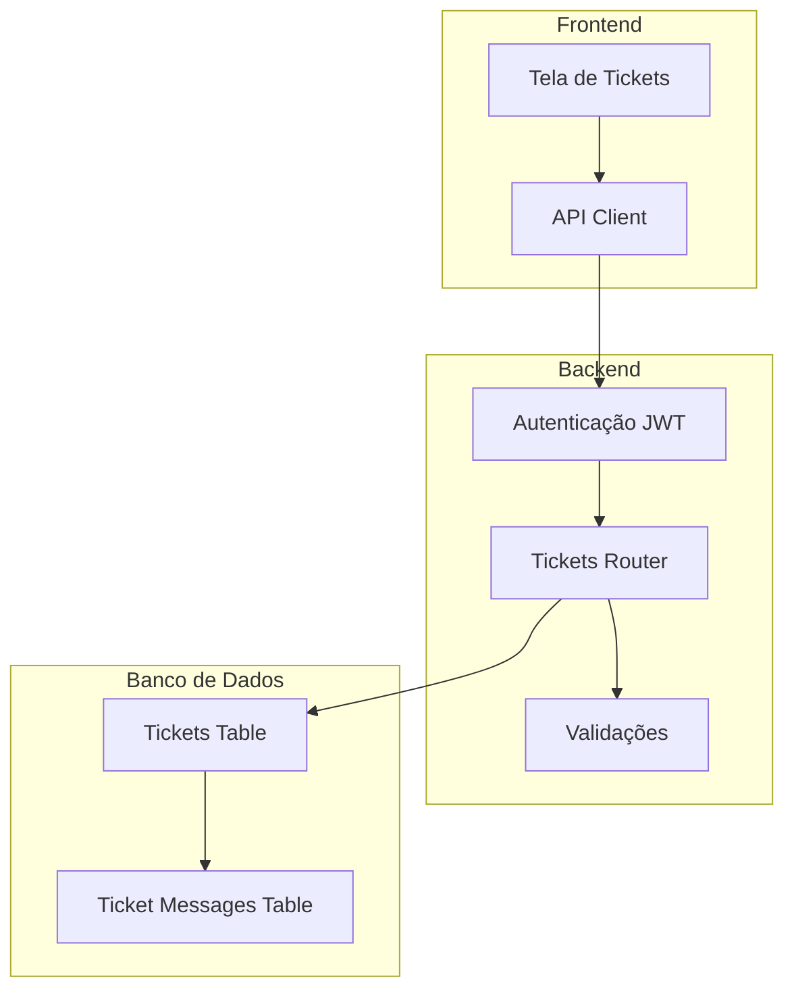
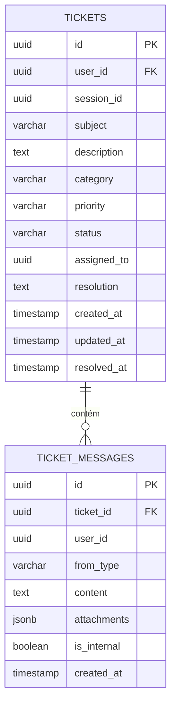
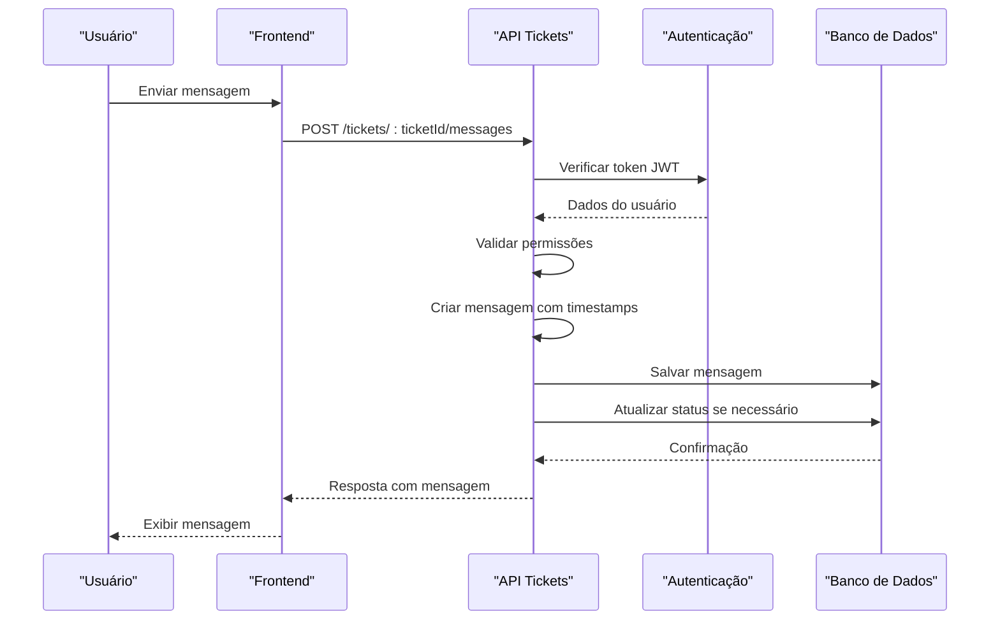
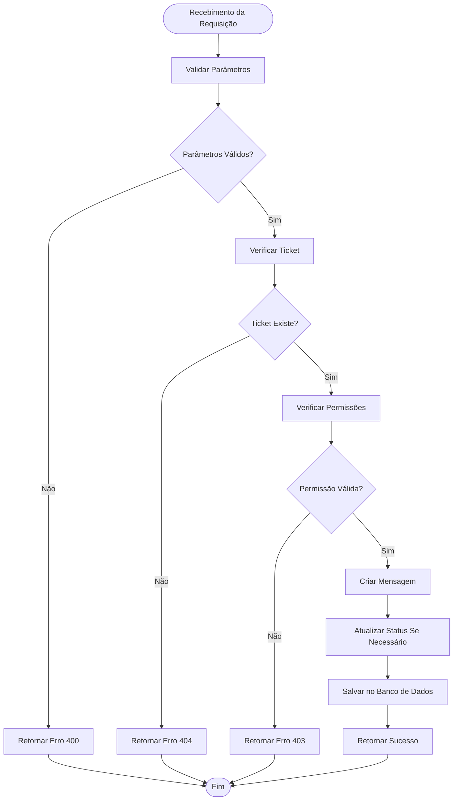
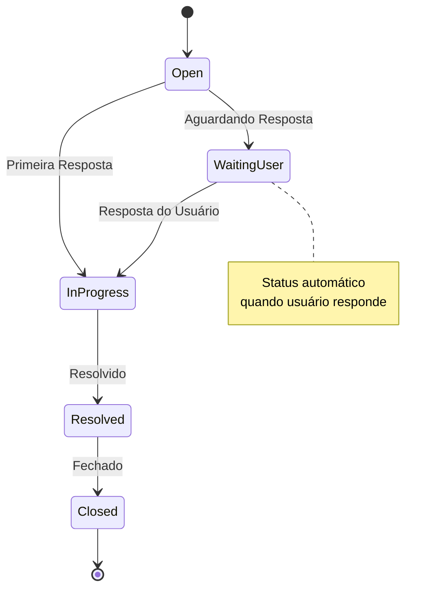
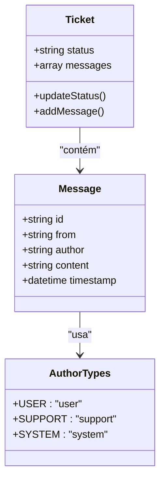
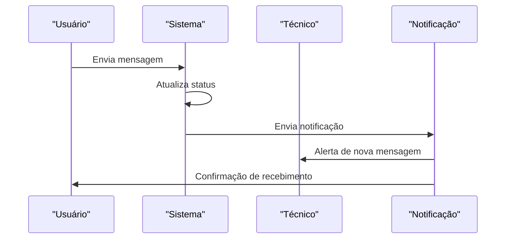

# Histórico de Mensagens

<cite>
**Arquivos Referenciados Neste Documento**
- [backend/src/routes/tickets.js](file://backend/src/routes/tickets.js)
- [backend/src/app.js](file://backend/src/app.js)
- [frontend/src/pages/Tickets.js](file://frontend/src/pages/Tickets.js)
- [frontend/src/services/api.js](file://frontend/src/services/api.js)
- [database/schema.sql](file://database/schema.sql)
</cite>

## Sumário
- O sistema de mensagens dentro dos tickets permite que usuários e técnicos mantenham um histórico completo de comunicação
- Diferencia automaticamente entre autores: usuário, suporte e sistema
- Garante atualizações automáticas de status quando usuários respondem a tickets aguardando resposta
- Mantém histórico ordenado cronologicamente com timestamps automáticos
- Integra-se ao fluxo de atendimento e notificações

## Arquitetura Geral do Sistema de Mensagens

O sistema de mensagens é composto por três camadas principais:



**Diagrama Fontes**
- [backend/src/routes/tickets.js:15-331](file://backend/src/routes/tickets.js#L15-L331)
- [database/schema.sql:53-92](file://database/schema.sql#L53-L92)

## Componentes Principais

### 1. Estrutura de Dados do Ticket

Cada ticket contém um array de mensagens que são armazenadas em ordem cronológica:



**Diagrama Fontes**
- [database/schema.sql:53-92](file://database/schema.sql#L53-L92)

### 2. Tipos de Autores e Diferenciação

O sistema identifica automaticamente o autor de cada mensagem com base no contexto:

| Tipo | Valor Interno | Descrição | Exemplo |
|------|---------------|-----------|---------|
| Usuário | `'user'` | Solicitante do ticket | `req.user.email` |
| Técnico | `'support'` | Atendente da equipe | `req.user.email` |
| Sistema | `'system'` | Mensagens automáticas | `Sistema` |

**Seção Fontes**
- [backend/src/routes/tickets.js:175-181](file://backend/src/routes/tickets.js#L175-L181)
- [database/schema.sql:87](file://database/schema.sql#L87)

### 3. Fluxo de Criação de Mensagem



**Diagrama Fontes**
- [backend/src/routes/tickets.js:152-197](file://backend/src/routes/tickets.js#L152-L197)
- [frontend/src/services/api.js:68-75](file://frontend/src/services/api.js#L68-L75)

## Funcionalidades Detalhadas

### 1. Validações de Conteúdo

O sistema aplica validações rigorosas para garantir qualidade das mensagens:



**Diagrama Fontes**
- [backend/src/routes/tickets.js:152-197](file://backend/src/routes/tickets.js#L152-L197)

### 2. Atualização Automática de Status

Quando usuários respondem a tickets aguardando resposta, o sistema atualiza automaticamente:



**Diagrama Fontes**
- [backend/src/routes/tickets.js:186-189](file://backend/src/routes/tickets.js#L186-L189)

### 3. Histórico Cronológico

O histórico de mensagens é mantido ordenado automaticamente:

| Campo | Tipo | Descrição | Exemplo |
|-------|------|-----------|---------|
| `id` | UUID | Identificador único | `uuid_generate_v4()` |
| `from` | String | Autor (`user`, `support`, `system`) | `'user'` |
| `author` | String | Email do autor | `'usuario@exemplo.com'` |
| `content` | Text | Conteúdo da mensagem | `'Preciso de ajuda com meu Apple ID'` |
| `timestamp` | DateTime | Timestamp automático | `CURRENT_TIMESTAMP` |

**Seção Fontes**
- [backend/src/routes/tickets.js:78-84](file://backend/src/routes/tickets.js#L78-L84)
- [backend/src/routes/tickets.js:175-181](file://backend/src/routes/tickets.js#L175-L181)

## Integração com Fluxo de Atendimento

### 1. Status do Ticket

Os status possíveis e suas transições:

| Status | Descrição | Transição Automática |
|--------|-----------|---------------------|
| `open` | Aberto | Primeira resposta do usuário |
| `in_progress` | Em Andamento | Qualquer resposta válida |
| `waiting_user` | Aguardando Usuário | Técnico aguarda resposta |
| `resolved` | Resolvido | Técnico marca como resolvido |
| `closed` | Fechado | Resolução finalizada |

### 2. Diferenciação de Autores



**Diagrama Fontes**
- [backend/src/routes/tickets.js:36-50](file://backend/src/routes/tickets.js#L36-L50)
- [backend/src/routes/tickets.js:175-181](file://backend/src/routes/tickets.js#L175-L181)

## Exemplos de Requisições

### 1. Adicionar Mensagem a um Ticket

**Endpoint:** `POST /api/v1/tickets/{ticketId}/messages`

**Headers:**
```
Authorization: Bearer SEU_TOKEN_JWT
Content-Type: application/json
```

**Corpo da Requisição:**
```json
{
  "content": "Estou com dificuldades para recuperar meu Apple ID. Preciso de ajuda urgente."
}
```

**Resposta de Sucesso:**
```json
{
  "success": true,
  "message": {
    "id": "uuid-da-mensagem",
    "from": "user",
    "author": "usuario@exemplo.com",
    "content": "Estou com dificuldades para recuperar meu Apple ID. Preciso de ajuda urgente.",
    "timestamp": "2024-01-15T10:30:00Z"
  }
}
```

### 2. Validações Realizadas

O sistema valida automaticamente:

- **Token JWT:** Verificação obrigatória para todas as operações
- **Permissões:** Apenas o criador do ticket ou técnicos/admins podem responder
- **Conteúdo:** Mensagem deve ter pelo menos 1 caractere
- **Formato:** UUID válido para ticketId

### 3. Timestamps Automáticos

Todos os timestamps são gerados automaticamente:

- `created_at`: Quando a mensagem é salva no banco
- `updated_at`: Quando o ticket é atualizado
- `timestamp`: Para cada mensagem individual

## Integração com Notificações

### 1. Fluxo de Notificações



### 2. Tipos de Notificações

| Evento | Destinatário | Conteúdo |
|--------|-------------|----------|
| Nova Mensagem | Técnico | `Novo usuário respondeu ao ticket` |
| Status Alterado | Usuário | `Status atualizado para "Em Andamento"` |
| Resposta Técnica | Usuário | `Técnico respondeu ao ticket` |

## Melhorias e Recomendações

### 1. Segurança Adicional

- Implementar rate limiting para mensagens
- Adicionar validações de conteúdo para evitar spam
- Criptografar mensagens sensíveis

### 2. Performance

- Indexar `ticket_messages.ticket_id` para consultas rápidas
- Implementar paginação para histórico longo
- Adicionar cache para tickets recentes

### 3. Funcionalidades Futuras

- Anexos de arquivos nas mensagens
- Respostas internas (visíveis apenas para técnicos)
- Notificações push em tempo real
- Histórico de alterações de status

## Conclusão

O sistema de mensagens dentro dos tickets oferece uma solução completa para comunicação entre usuários e técnicos, com diferenciação automática de autores, atualizações de status inteligentes e histórico cronológico completo. A implementação segue boas práticas de segurança e validação, garantindo integridade e confiabilidade do fluxo de atendimento.