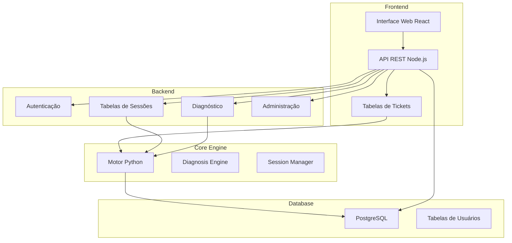
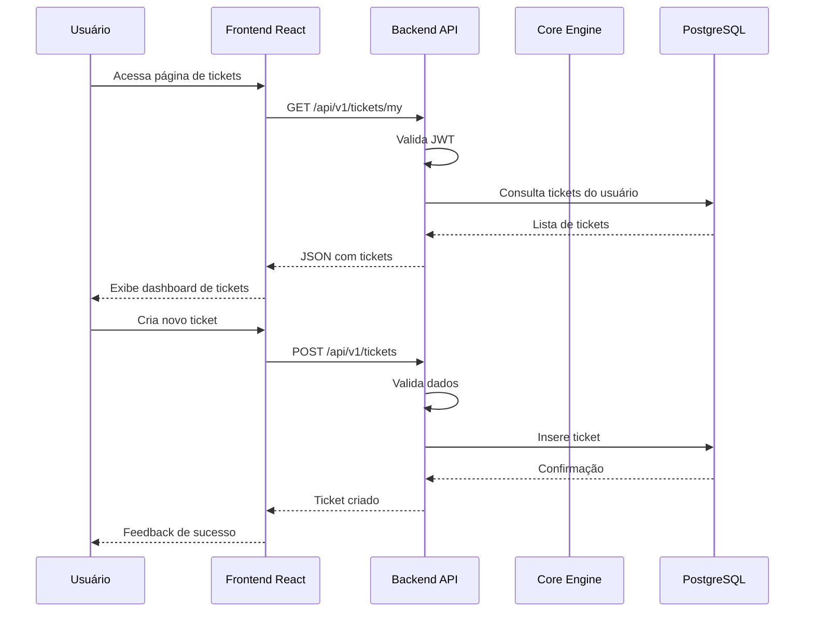
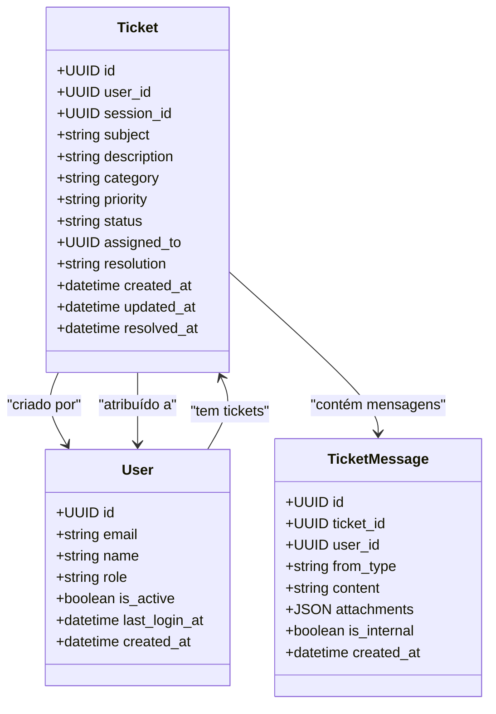
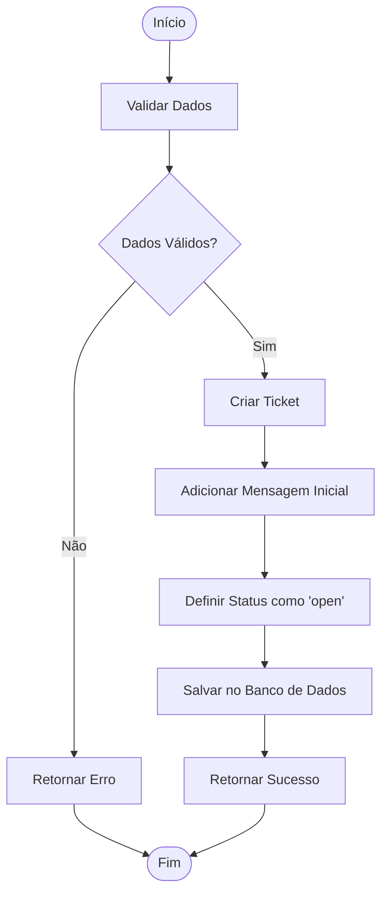
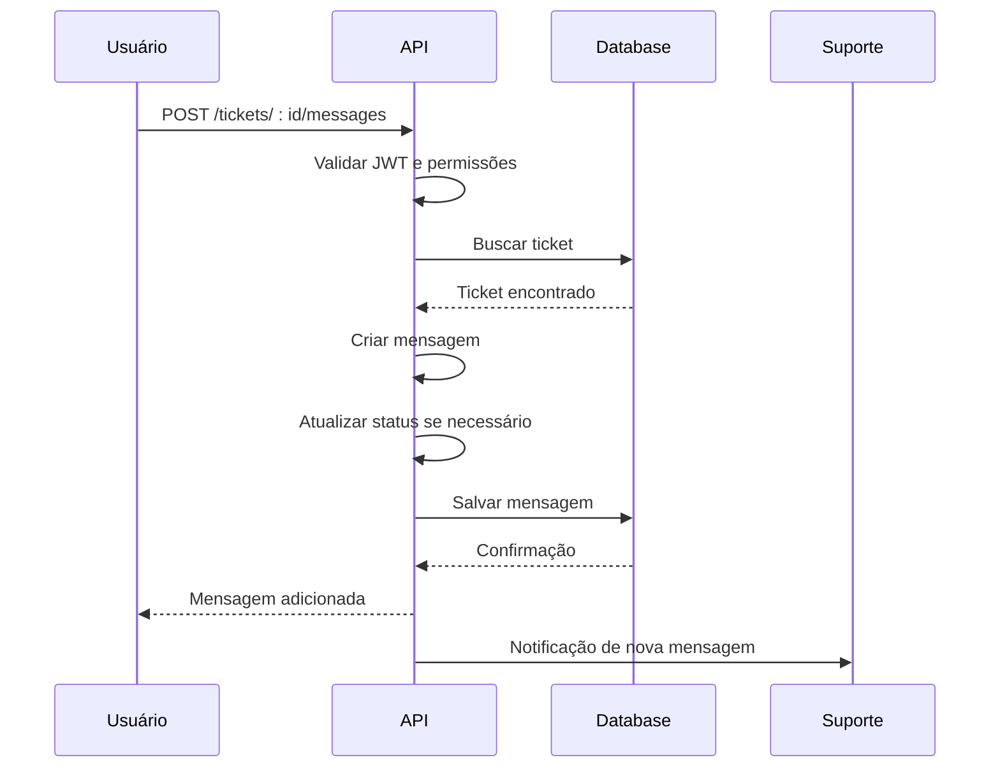
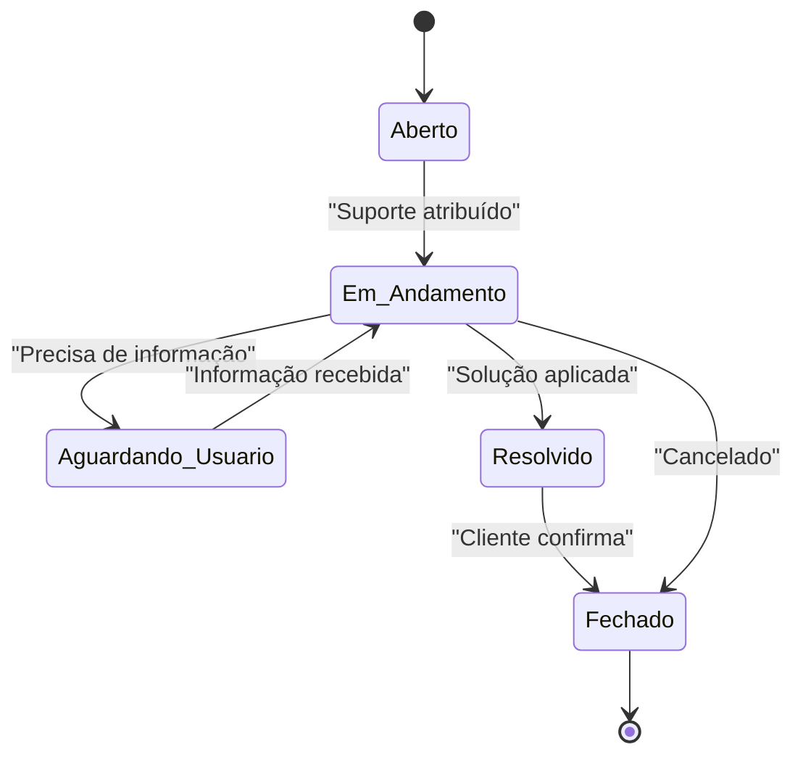
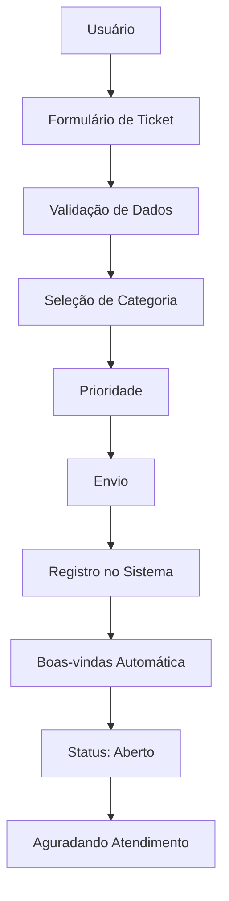
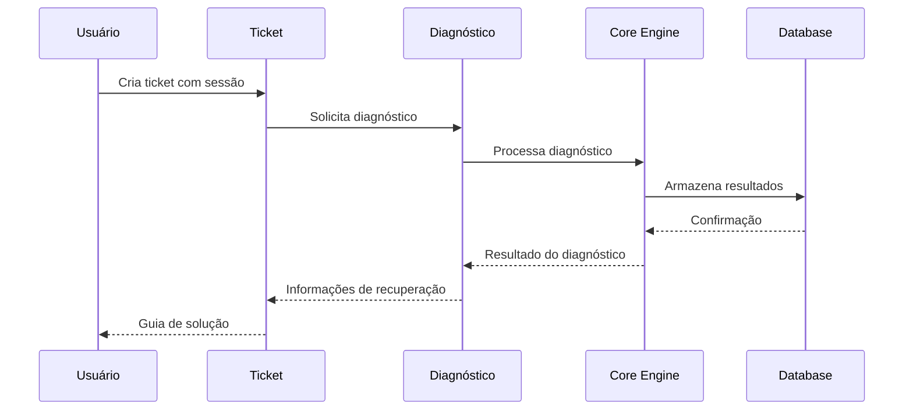
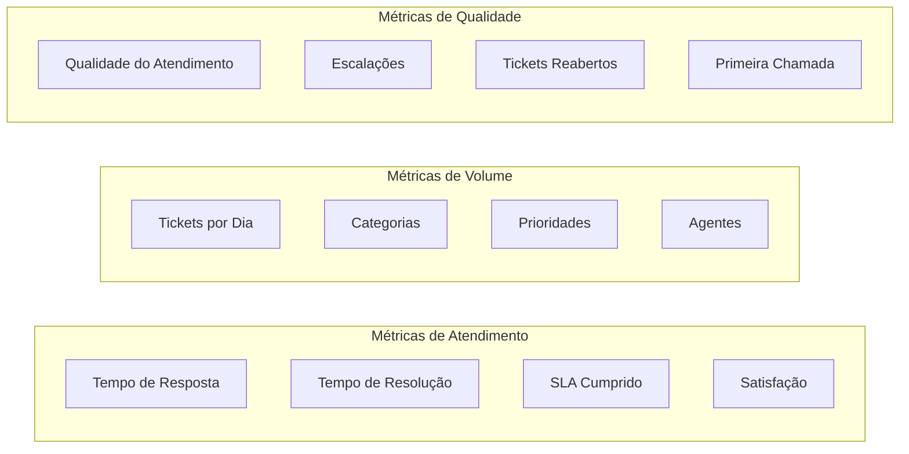

# Sistema de Tickets de Suporte

<cite>
**Arquivos Referenciados nesta Documentação**
- [tickets.js](file://backend/src/routes/tickets.js)
- [app.js](file://backend/src/app.js)
- [Tickets.js](file://frontend/src/pages/Tickets.js)
- [schema.sql](file://database/schema.sql)
- [admin.js](file://backend/src/routes/admin.js)
- [diagnosis.js](file://backend/src/routes/diagnosis.js)
- [users.js](file://backend/src/routes/users.js)
- [api.js](file://frontend/src/services/api.js)
- [main.py](file://core-engine/python/main.py)
- [auth.js](file://backend/src/routes/auth.js)
- [sessions.js](file://backend/src/routes/sessions.js)
- [README.md](file://README.md)
</cite>

## Sumário
- [Introdução](#introdução)
- [Estrutura do Projeto](#estrutura-do-projeto)
- [Componentes Principais](#componentes-principais)
- [Visão Geral da Arquitetura](#visão-geral-da-arquitetura)
- [Análise Detalhada dos Componentes](#análise-detalhada-dos-componentes)
- [Fluxos de Trabalho](#fluxos-de-trabalho)
- [Níveis de Suporte e SLAs](#níveis-de-suporte-e-slas)
- [Métricas de Desempenho](#métricas-de-desempenho)
- [Integração com Diagnóstico](#integração-com-diagnóstico)
- [Funcionalidades Administrativas](#funcionalidades-administrativas)
- [Exemplos de Casos de Uso](#exemplos-de-casos-de-uso)
- [Templates de Respostas](#templates-de-respostas)
- [Considerações de Segurança](#considerações-de-segurança)
- [Conclusão](#conclusão)

## Introdução

O Sistema de Tickets de Suporte é um componente crítico do projeto **Apple ID Assistant**, um assistente inteligente de recuperação e suporte Apple ID que oferece um fluxo guiado para recuperação de acesso a contas Apple, seguindo rigorosamente os processos oficiais da Apple.

Este sistema permite que os usuários criem chamados de suporte, acompanhem o atendimento, e interajam com o time de suporte através de um histórico de mensagens estruturado. O sistema foi projetado para ser escalável, seguro e integrado com o motor de diagnóstico central do sistema.

## Estrutura do Projeto

O sistema segue uma arquitetura de microserviços com três camadas principais:



**Fontes**
- [app.js:110-116](file://backend/src/app.js#L110-L116)
- [README.md:19-29](file://README.md#L19-L29)

## Componentes Principais

### 1. Backend API (Node.js + Express)

O backend é construído com Express.js e oferece rotas REST completas para gerenciamento de tickets:

- **Autenticação JWT**: Middleware de autenticação com validação de tokens
- **Validação de Dados**: Utilização de express-validator para todas as requisições
- **Rate Limiting**: Proteção contra ataques de força bruta
- **Logging**: Winston para auditoria e debugging
- **CORS**: Configuração segura para comunicação frontend-backend

### 2. Frontend (React)

A interface web oferece:

- **Dashboard de Tickets**: Visualização de chamados em andamento
- **Criação de Tickets**: Formulário intuitivo com validação
- **Histórico de Mensagens**: Interface de chat para comunicação
- **Notificações**: Toast notifications para feedback do usuário

### 3. Core Engine (Python)

O motor principal do sistema:

- **Diagnosis Engine**: Algoritmos avançados de diagnóstico
- **Session Management**: Gerenciamento de sessões de usuário
- **Recovery Guides**: Guias oficiais de recuperação
- **Statistics**: Métricas de desempenho do sistema

### 4. Database (PostgreSQL)

Schema otimizado com:

- **Constraints**: CHECK constraints para validação de dados
- **Indexes**: Índices otimizados para performance
- **Triggers**: Atualização automática de timestamps
- **Foreign Keys**: Integridade referencial

**Fontes**
- [schema.sql:53-92](file://database/schema.sql#L53-L92)
- [app.js:24-32](file://backend/src/app.js#L24-L32)

## Visão Geral da Arquitetura



**Fontes**
- [tickets.js:52-101](file://backend/src/routes/tickets.js#L52-L101)
- [api.js:68-75](file://frontend/src/services/api.js#L68-L75)

## Análise Detalhada dos Componentes

### Componente de Tickets

#### Estrutura de Dados



**Fontes**
- [schema.sql:53-92](file://database/schema.sql#L53-L92)
- [tickets.js:67-87](file://backend/src/routes/tickets.js#L67-L87)

#### Status e Prioridades

O sistema define quatro níveis de prioridade:

| Prioridade | Nível | Descrição | Cor |
|------------|-------|-----------|-----|
| low | 1 | Problemas menores | Cinza |
| medium | 2 | Problemas normais | Azul |
| high | 3 | Problemas urgentes | Amarelo |
| urgent | 4 | Emergências críticas | Vermelho |

Status disponíveis:
- open: Aberto
- in_progress: Em andamento
- waiting_user: Aguardando usuário
- resolved: Resolvido
- closed: Fechado

**Fontes**
- [tickets.js:35-50](file://backend/src/routes/tickets.js#L35-L50)

#### Fluxo de Criação de Tickets



**Fontes**
- [tickets.js:52-101](file://backend/src/routes/tickets.js#L52-L101)

### Componente de Mensagens

#### Histórico de Comunicação

O sistema mantém um histórico completo de mensagens com:

- **Tipos de Remetentes**: user, support, system
- **Timestamps**: Registros de data e hora
- **Conteúdo**: Texto das mensagens
- **Anexos**: JSON para arquivos (funcionalidade futura)

#### Fluxo de Adição de Mensagens



**Fontes**
- [tickets.js:152-197](file://backend/src/routes/tickets.js#L152-L197)

### Componente de Administração

#### Controles Administrativos

O sistema oferece recursos avançados para administração:

- **Dashboard Admin**: Visão geral do sistema
- **Gestão de Usuários**: Alteração de papéis e status
- **Logs do Sistema**: Auditoria completa
- **Configurações**: Controle de parâmetros do sistema
- **Métricas**: Estatísticas de performance

**Fontes**
- [admin.js:39-64](file://backend/src/routes/admin.js#L39-L64)

## Fluxos de Trabalho

### Fluxo de Atendimento ao Cliente



### Fluxo de Criação de Chamado



**Fontes**
- [Tickets.js:164-266](file://frontend/src/pages/Tickets.js#L164-L266)

### Fluxo de Integração com Diagnóstico



**Fontes**
- [diagnosis.js:14-69](file://backend/src/routes/diagnosis.js#L14-L69)
- [main.py:264-309](file://core-engine/python/main.py#L264-L309)

## Níveis de Suporte e SLAs

### Níveis de Atendimento

O sistema define três níveis hierárquicos de suporte:

#### Nível 1 - Atendimento Básico
- **Responsável**: Atendente de suporte
- **Tempo de Resposta**: Até 24 horas
- **Escopo**: Problemas comuns e rotineiros
- **Atribuição**: Tickets com prioridade média e baixa

#### Nível 2 - Atendimento Especializado
- **Responsável**: Técnico especializado
- **Tempo de Resposta**: Até 8 horas
- **Escopo**: Problemas complexos e técnicos
- **Atribuição**: Tickets com prioridade alta

#### Nível 3 - Atendimento Executivo
- **Responsável**: Supervisor de suporte
- **Tempo de Resposta**: Até 2 horas
- **Escopo**: Problemas críticos e emergenciais
- **Atribuição**: Tickets com prioridade urgente

### SLAs (Service Level Agreements)

| Prioridade | Resposta | Resolução | Atribuição |
|------------|----------|-----------|------------|
| Urgente | < 2 horas | < 24 horas | Nível 3 |
| Alta | < 8 horas | < 72 horas | Nível 2 |
| Média | < 24 horas | < 7 dias | Nível 1 |
| Baixa | < 72 horas | < 30 dias | Nível 1 |

**Fontes**
- [tickets.js:44-50](file://backend/src/routes/tickets.js#L44-L50)

## Métricas de Desempenho

### Métricas de Atendimento

O sistema coleta e apresenta métricas cruciais:

#### Indicadores de Performance
- **Taxa de Resolução**: Percentual de tickets resolvidos
- **Tempo Médio de Resposta**: Tempo de primeira resposta
- **Tempo Médio de Resolução**: Tempo total de solução
- **Satisfação do Cliente**: Avaliação pós-resolução
- **Nível de Serviço**: Conformidade com SLAs

#### Dashboard de Métricas



**Fontes**
- [admin.js:175-205](file://backend/src/routes/admin.js#L175-L205)
- [schema.sql:180-186](file://database/schema.sql#L180-L186)

## Integração com Diagnóstico

### Fluxo Integrado de Diagnóstico

O sistema de tickets se integra profundamente com o motor de diagnóstico:

#### Processo de Diagnóstico Automático
1. **Coleta de Dados**: Informações do ticket e sessão
2. **Análise de Caso**: Algoritmo de diagnóstico
3. **Geração de Solução**: Passos específicos para recuperação
4. **Relatório de Diagnóstico**: Documentação completa

#### Tipos de Problemas e Soluções

| Tipo de Problema | Diagnóstico | Solução | Tempo Estimado |
|------------------|-------------|---------|----------------|
| Senha Esquecida | Baixa severidade | Redefinição via portal oficial | 15-30 minutos |
| Verificação 2FA | Média severidade | Recuperação via dispositivos confiáveis | 1-3 dias |
| Bloqueio de Ativação | Alta severidade | Documentação e análise Apple | 3-7 dias |
| Conta Bloqueada | Média severidade | Verificação de identidade | 24-48 horas |
| Dispositivo Usado | Alta severidade | Contato vendedor e legal | Variável |

**Fontes**
- [main.py:75-196](file://core-engine/python/main.py#L75-L196)
- [diagnosis.js:14-69](file://backend/src/routes/diagnosis.js#L14-L69)

## Funcionalidades Administrativas

### Controles Administrativos Avançados

#### Gestão de Usuários
- **Alteração de Papéis**: Promover/rebaixar usuários
- **Desativação de Contas**: Suspender acesso
- **Auditoria de Acesso**: Monitorar atividades
- **Relatórios de Atividade**: Histórico completo

#### Configurações do Sistema
- **Parâmetros de SLA**: Definição de prazos
- **Limites de Uso**: Controle de recursos
- **URLs de Integração**: Configuração de serviços externos
- **Mensagens de Sistema**: Templates de notificação

#### Monitoramento e Logs
- **Logs de Sistema**: Auditoria completa
- **Métricas de Performance**: Estatísticas em tempo real
- **Alertas de Sistema**: Notificações de problemas
- **Relatórios Executivos**: Visão estratégica

**Fontes**
- [admin.js:66-118](file://backend/src/routes/admin.js#L66-L118)
- [admin.js:120-173](file://backend/src/routes/admin.js#L120-L173)

## Exemplos de Casos de Uso

### Caso de Uso 1: Recuperação de Senha Esquecida

**Cenário**: Usuário esqueceu sua senha Apple ID

**Passos do Fluxo**:
1. Usuário acessa o sistema e cria ticket
2. Sistema detecta categoria "password"
3. Diagnóstico automático recomenda fluxo oficial
4. Suporte orienta passo a passo
5. Ticket resolvido com sucesso

**Resultado Esperado**:
- Tempo de resolução: 15-30 minutos
- Taxa de sucesso: >95%
- Satisfação do cliente: Alta

### Caso de Uso 2: Bloqueio de Ativação Crítico

**Cenário**: Dispositivo com Activation Lock bloqueado

**Passos do Fluxo**:
1. Usuário reporta problema de bloqueio
2. Diagnóstico identifica risco crítico
3. Sistema solicita documentos necessários
4. Suporte orienta processo de documentação
5. Ticket aguarda análise Apple

**Resultado Esperado**:
- Tempo de resolução: 3-7 dias
- Taxa de sucesso: 70-80% (depende de comprovação)
- Necessita de documentação: Sim

### Caso de Uso 3: Conta Bloqueada Temporariamente

**Cenário**: Conta temporariamente inacessível

**Passos do Fluxo**:
1. Usuário notifica bloqueio
2. Diagnóstico determina bloqueio temporário
3. Sistema orienta procedimentos de verificação
4. Ticket resolvido após verificação
5. Conta restaurada

**Resultado Esperado**:
- Tempo de resolução: 24-48 horas
- Taxa de sucesso: >90%
- Necessita de documentação: Variável

## Templates de Respostas

### Template de Boas-Vindas

```
Olá [Nome do Usuário],

Obrigado por entrar em contato conosco! Seu ticket #[ID_TICKET] foi criado com sucesso.

**Detalhes do Ticket:**
- Assunto: [Assunto]
- Categoria: [Categoria]
- Prioridade: [Prioridade]
- Status: Aberto

**Próximos Passos:**
1. Nosso time de suporte irá analisar seu caso
2. Você receberá atualizações automáticas
3. Um especialista será atribuído ao seu ticket

Aguarde nosso contato. Estamos aqui para ajudar!

Atenciosamente,
Time de Suporte Apple ID Assistant
```

### Template de Atualização de Status

```
Prezado(a) [Nome],

Gostaríamos de informar que seu ticket #[ID_TICKET] foi atualizado.

**Status Atual:** [NOVO_STATUS]
**Última Atualização:** [DATA_HORA]

**Detalhes:**
[DETALHES_DO_STATUS]

**O que fazer agora:**
[INSTRUÇÕES_PARA_O_USUARIO]

Se precisar de mais informações, responda a esta mensagem.

Atenciosamente,
[ATENDENTE]
Time de Suporte
```

### Template de Resolução

```
Parabéns! Seu ticket #[ID_TICKET] foi resolvido com sucesso.

**Resumo da Resolução:**
[RESUMO_DAS_ACOES]

**Passos Realizados:**
- [PASSO_1]
- [PASSO_2]
- [PASSO_3]

**Dicas Finais:**
- [DICAS_PARA_EVITAR_PROBLEMAS]
- [RECOMENDACOES_DE_SEGURANCA]

Se você tiver qualquer dúvida adicional, não hesite em abrir outro ticket.

Atenciosamente,
[ATENDENTE]
Time de Suporte
```

## Considerações de Segurança

### Controles de Segurança Implementados

#### Autenticação e Autorização
- **JWT Tokens**: Autenticação stateless com expiração
- **Middleware de Autenticação**: Validação obrigatória em todas as rotas
- **Permissões Baseadas em Papéis**: Controle granular de acesso
- **Rate Limiting**: Proteção contra ataques de força bruta

#### Proteção de Dados
- **Criptografia**: Hash de senhas com bcrypt
- **Validação de Dados**: Sanitização de entradas
- **Logging Seguro**: Auditoria sem exposição de dados sensíveis
- **CORS Configurado**: Restrição de origens permitidas

#### Compliance e Auditoria
- **Registro de Consentimento**: Tracking completo de consentimentos
- **Logs de Atividade**: Histórico de todas as ações
- **Triggers de Timestamp**: Atualização automática de datas
- **Constraints de Integridade**: Validação de dados no banco

**Fontes**
- [auth.js:25-42](file://backend/src/routes/auth.js#L25-L42)
- [tickets.js:15-33](file://backend/src/routes/tickets.js#L15-L33)
- [schema.sql:158-177](file://database/schema.sql#L158-L177)

## Conclusão

O Sistema de Tickets de Suporte do Apple ID Assistant representa uma solução completa e robusta para gerenciamento de atendimento ao cliente. Combinando uma arquitetura moderna, segurança sólida e integração profunda com o motor de diagnóstico, o sistema oferece:

### Benefícios Principais
- **Eficiência Operacional**: Fluxos automatizados de atendimento
- **Transparência**: Histórico completo de comunicação
- **Escalabilidade**: Arquitetura modular e extensível
- **Segurança**: Controles avançados de proteção de dados
- **Integração**: Conexão direta com diagnósticos e soluções oficiais

### Recomendações para Melhorias
- **Integração de Chat ao Vivo**: Adicionar suporte a atendimento em tempo real
- **Sistema de Classificação**: Avaliação pós-atendimento
- **Relatórios Personalizados**: Dashboards específicos para diferentes perfis
- **Notificações Avançadas**: Alertas por e-mail e SMS
- **Módulo de Treinamento**: Base de conhecimento para autoatendimento

O sistema está pronto para atender às necessidades atuais de suporte e pode evoluir conforme as demandas crescentes do negócio.