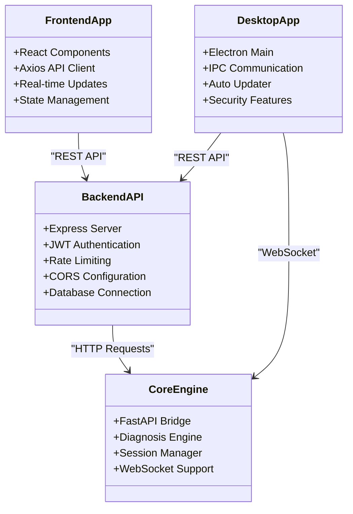
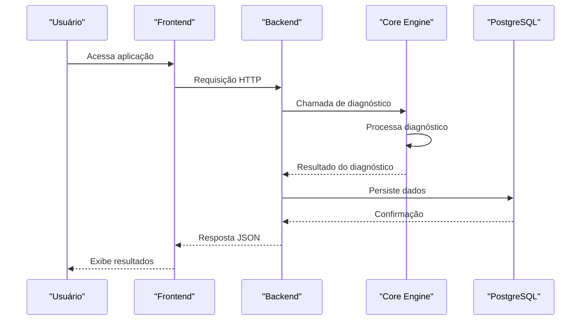
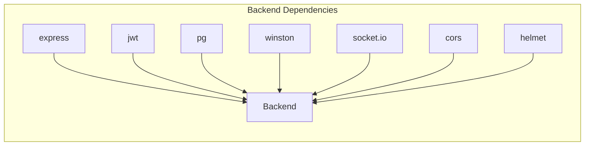
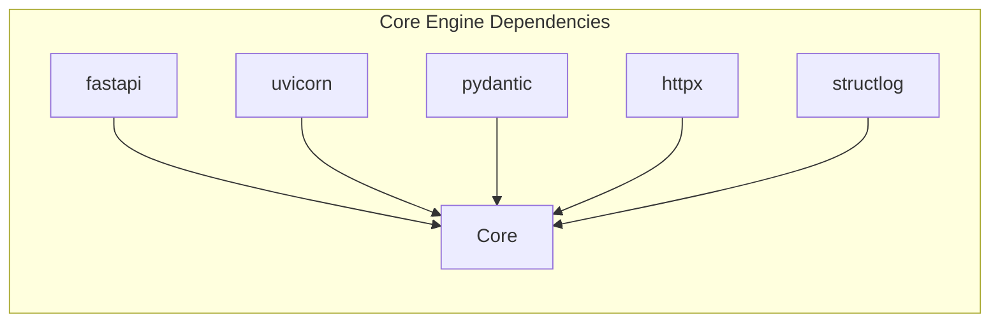
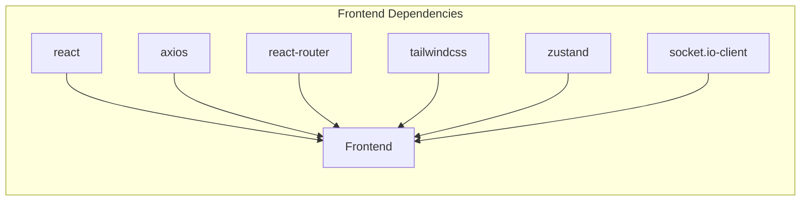

# Instalação e Configuração

<cite>
**Arquivos referenciados neste documento**
- [README.md](file://README.md)
- [backend/package.json](file://backend/package.json)
- [backend/src/app.js](file://backend/src/app.js)
- [core-engine/python/requirements.txt](file://core-engine/python/requirements.txt)
- [core-engine/python/main.py](file://core-engine/python/main.py)
- [core-engine/bridge/api.py](file://core-engine/bridge/api.py)
- [desktop/electron-app/package.json](file://desktop/electron-app/package.json)
- [desktop/electron-app/main.js](file://desktop/electron-app/main.js)
- [frontend/package.json](file://frontend/package.json)
- [frontend/src/services/api.js](file://frontend/src/services/api.js)
- [database/schema.sql](file://database/schema.sql)
- [database/migrations/001_initial_schema.sql](file://database/migrations/001_initial_schema.sql)
</cite>

## Sumário
1. [Introdução](#introdução)
2. [Estrutura do Projeto](#estrutura-do-projeto)
3. [Pré-requisitos do Sistema](#pré-requisitos-do-sistema)
4. [Instalação e Configuração](#instalação-e-configuração)
5. [Arquitetura Geral](#arquitetura-geral)
6. [Análise Detalhada dos Componentes](#análise-detalhada-dos-componentes)
7. [Análise de Dependências](#análise-de-dependências)
8. [Considerações de Desempenho](#considerações-de-desempenho)
9. [Guia de Solução de Problemas](#guia-de-solução-de-problemas)
10. [Conclusão](#conclusão)

## Introdução
O Bay-RSET Tool é um assistente profissional de recuperação e suporte Apple ID que oferece fluxos guiados para redefinição de senha, verificação em duas etapas, bloqueio de ativação e acompanhamento de chamados. O sistema segue rigorosamente os processos oficiais da Apple e inclui medidas de segurança robustas, como criptografia de dados, consentimento registrado e rate limiting nas APIs.

## Estrutura do Projeto
O projeto segue uma arquitetura de microsserviços com quatro camadas principais:
- Backend (Node.js/Express): API REST com autenticação JWT, segurança e logs
- Core Engine (Python/FastAPI): Motor de diagnóstico e lógica de negócio
- Frontend (React): Interface web com navegação e integração em tempo real
- Desktop (Electron): Aplicativo desktop com atualização automática

```mermaid
graph TB
subgraph "Camada Frontend"
FE[React App<br/>Frontend]
end
subgraph "Camada Backend"
BE[Express API<br/>Backend]
DB[(PostgreSQL)]
end
subgraph "Camada Core Engine"
CE[FastAPI Bridge<br/>Core Engine]
PY[Python Core<br/>Diagnóstico]
end
subgraph "Camada Desktop"
DE[Electron App<br/>Desktop]
end
FE --> BE
BE --> DB
BE <- --> CE
CE --> PY
DE --> BE
DE <- --> CE
```

**Diagrama fonte**
- [backend/src/app.js:15-204](file://backend/src/app.js#L15-L204)
- [core-engine/bridge/api.py:164-563](file://core-engine/bridge/api.py#L164-L563)
- [core-engine/python/main.py:263-701](file://core-engine/python/main.py#L263-L701)
- [desktop/electron-app/main.js:1-324](file://desktop/electron-app/main.js#L1-L324)

**Seção fonte**
- [README.md:19-29](file://README.md#L19-L29)

## Pré-requisitos do Sistema
Antes de instalar o Bay-RSET Tool, verifique os seguintes requisitos mínimos:

### Requisitos Mínimos
- **Node.js**: Versão 18+ (backend)
- **Python**: Versão 3.8+ (core engine)
- **PostgreSQL**: Versão 14+ (banco de dados)
- **Redis**: Opcional (cache e mensagens)

### Recomendações de Hardware
- **Desenvolvimento**: CPU dual-core 2.5GHz+, 8GB RAM, 20GB SSD
- **Produção**: CPU quad-core 3.0GHz+, 16GB RAM, 50GB SSD

**Seção fonte**
- [README.md:33-39](file://README.md#L33-L39)

## Instalação e Configuração

### Passos Iniciais
1. Clone o repositório
2. Instale as dependências de cada camada
3. Configure o banco de dados PostgreSQL
4. Inicie os serviços em ordem

### Camada Backend (Node.js)
```bash
# Navegue até a pasta backend
cd backend

# Instale dependências
npm install

# Copie arquivo de configuração
cp .env.example .env

# Inicie em modo desenvolvimento
npm run dev
```

**Configurações principais do backend:**
- Porta padrão: 3000
- URLs de serviço: CORE_ENGINE_URL, DATABASE_URL, REDIS_URL
- JWT_SECRET: Chave secreta para tokens
- ALLOWED_ORIGINS: Domínios permitidos

**Seção fonte**
- [README.md:40-47](file://README.md#L40-L47)
- [backend/package.json:6-12](file://backend/package.json#L6-L12)
- [backend/src/app.js:25-32](file://backend/src/app.js#L25-L32)

### Camada Core Engine (Python)
```bash
# Navegue até a pasta core-engine
cd core-engine/python

# Instale dependências
pip install -r requirements.txt

# Inicie o motor principal
python main.py
```

**Configurações principais do core engine:**
- Porta padrão: 8000
- URLs de serviço: CORE_ENGINE_URL
- Logs: core_engine.log
- Documentação: /docs

**Seção fonte**
- [README.md:49-55](file://README.md#L49-L55)
- [core-engine/python/requirements.txt:1-27](file://core-engine/python/requirements.txt#L1-L27)
- [core-engine/bridge/api.py:544-563](file://core-engine/bridge/api.py#L544-L563)

### Camada Frontend (React)
```bash
# Navegue até a pasta frontend
cd frontend

# Instale dependências
npm install

# Inicie em modo desenvolvimento
npm start
```

**Configurações principais do frontend:**
- Proxy para backend: http://localhost:3001
- Variável de ambiente: REACT_APP_API_URL
- Build: npm run build

**Seção fonte**
- [README.md:57-63](file://README.md#L57-L63)
- [frontend/package.json:26-32](file://frontend/package.json#L26-L32)
- [frontend/src/services/api.js:4](file://frontend/src/services/api.js#L4)

### Camada Desktop (Electron)
```bash
# Navegue até a pasta desktop
cd desktop/electron-app

# Instale dependências
npm install

# Inicie em modo desenvolvimento
npm start
```

**Configurações principais do desktop:**
- URLs de serviço: API_URL, SOCKET_URL
- Atualização automática: electron-updater
- Build: npm run build

**Seção fonte**
- [README.md:65-71](file://README.md#L65-L71)
- [desktop/electron-app/package.json:6-11](file://desktop/electron-app/package.json#L6-L11)
- [desktop/electron-app/main.js:14-20](file://desktop/electron-app/main.js#L14-L20)

## Configuração Inicial do Banco de Dados

### Criação do Banco de Dados
1. Crie um banco de dados PostgreSQL
2. Ative a extensão UUID
3. Execute o schema inicial
4. Configure as credenciais no backend

### Schema do Banco de Dados
O schema define as seguintes entidades principais:
- **Usuários**: Cadastro de usuários com perfis (user, support, admin)
- **Sessões**: Sessões de recuperação com consentimento
- **Chamados**: Sistema completo de tickets de suporte
- **Logs de Atividade**: Auditoria completa de ações
- **Configurações do Sistema**: Parâmetros de configuração

### Migrações
O projeto inclui migrações iniciais que criam as tabelas básicas e índices necessários para performance.

**Seção fonte**
- [database/schema.sql:1-194](file://database/schema.sql#L1-L194)
- [database/migrations/001_initial_schema.sql:1-57](file://database/migrations/001_initial_schema.sql#L1-L57)

## Variáveis de Ambiente

### Backend (Node.js)
| Variável | Descrição | Valor Padrão |
|----------|-----------|--------------|
| PORT | Porta do servidor | 3000 |
| NODE_ENV | Ambiente | development |
| JWT_SECRET | Chave JWT | sua-chave-secreta |
| CORE_ENGINE_URL | URL do Core Engine | http://localhost:8000 |
| DATABASE_URL | Conexão PostgreSQL | - |
| REDIS_URL | Conexão Redis | - |
| ALLOWED_ORIGINS | Domínios permitidos | http://localhost:3000 |

### Core Engine (Python)
| Variável | Descrição | Valor Padrão |
|----------|-----------|--------------|
| CORE_ENGINE_PORT | Porta do servidor | 8000 |
| LOG_LEVEL | Nível de log | INFO |
| DEBUG_MODE | Modo debug | False |

### Frontend (React)
| Variável | Descrição | Valor Padrão |
|----------|-----------|--------------|
| REACT_APP_API_URL | URL da API | http://localhost:3000 |
| REACT_APP_SOCKET_URL | URL WebSocket | ws://localhost:8000 |

### Desktop (Electron)
| Variável | Descrição | Valor Padrão |
|----------|-----------|--------------|
| API_URL | URL da API | https://api.bayreset.com |
| SOCKET_URL | URL WebSocket | wss://api.bayreset.com |
| NODE_ENV | Ambiente | production |

**Seção fonte**
- [backend/src/app.js:25-32](file://backend/src/app.js#L25-L32)
- [frontend/src/services/api.js:4](file://frontend/src/services/api.js#L4)
- [desktop/electron-app/main.js:14-20](file://desktop/electron-app/main.js#L14-L20)

## Inicialização dos Serviços

### Ambiente de Desenvolvimento
```bash
# Terminal 1: Core Engine
cd core-engine/python
python main.py

# Terminal 2: Backend
cd backend
npm run dev

# Terminal 3: Frontend
cd frontend
npm start

# Terminal 4: Desktop
cd desktop/electron-app
npm start
```

### Ambiente de Produção
```bash
# Backend
cd backend
npm run start

# Core Engine
cd core-engine/python
uvicorn api:app --host 0.0.0.0 --port 8000

# Frontend
cd frontend
npm run build

# Desktop
cd desktop/electron-app
npm run build
```

## Arquitetura Geral

### Componentes Principais


**Diagrama fonte**
- [backend/src/app.js:15-204](file://backend/src/app.js#L15-L204)
- [core-engine/bridge/api.py:164-563](file://core-engine/bridge/api.py#L164-L563)
- [desktop/electron-app/main.js:1-324](file://desktop/electron-app/main.js#L1-L324)

### Fluxo de Comunicação


**Diagrama fonte**
- [frontend/src/services/api.js:1-130](file://frontend/src/services/api.js#L1-L130)
- [backend/src/app.js:110-144](file://backend/src/app.js#L110-L144)
- [core-engine/bridge/api.py:213-283](file://core-engine/bridge/api.py#L213-L283)

## Análise Detalhada dos Componentes

### Backend (Node.js/Express)
O backend implementa uma API REST completa com as seguintes características:

#### Segurança
- **Helmet.js**: Headers de segurança HTTP
- **CORS**: Configuração controlada de origens
- **Rate Limiting**: Proteção contra ataques
- **JWT**: Autenticação de usuários
- **Bcrypt**: Hash de senhas

#### Rotas Principais
- `/api/v1/auth`: Autenticação e registro
- `/api/v1/sessions`: Gerenciamento de sessões
- `/api/v1/diagnosis`: Diagnósticos e guias
- `/api/v1/tickets`: Sistema de chamados
- `/api/v1/admin`: Funcionalidades administrativas

#### Logs e Monitoramento
- **Winston**: Logging estruturado
- **Morgan**: Logs HTTP
- **Health Check**: Endpoint de verificação

**Seção fonte**
- [backend/src/app.js:15-204](file://backend/src/app.js#L15-L204)
- [backend/package.json:23-47](file://backend/package.json#L23-L47)

### Core Engine (Python/FastAPI)
O core engine é o cérebro do sistema, responsável por:

#### Motor de Diagnóstico
- **Tipos de Problema**: Senha esquecida, verificação 2FA, bloqueio de ativação
- **Níveis de Severidade**: Baixo, médio, alto
- **Tempo Estimado**: Baseado no tipo de problema

#### Gerenciamento de Sessões
- **Criação de Sessões**: UUID único para cada usuário
- **Consentimento**: Registro de consentimento com IP
- **Status**: Rastreamento do progresso do caso

#### API REST Completa
- **Sessões**: Criação, consulta e atualização
- **Diagnósticos**: Processamento de casos
- **Consentimento**: Registro legal
- **Guias**: Recuperação oficial
- **Estatísticas**: Métricas do sistema

**Seção fonte**
- [core-engine/python/main.py:76-354](file://core-engine/python/main.py#L76-L354)
- [core-engine/bridge/api.py:164-563](file://core-engine/bridge/api.py#L164-L563)

### Frontend (React)
O frontend oferece uma experiência completa com:

#### Componentes Principais
- **Navbar**: Navegação e autenticação
- **AdminRoute**: Proteção de rotas administrativas
- **ProtectedRoute**: Acesso restrito
- **Páginas**: Dashboard, Login, Tickets, Admin

#### Integração em Tempo Real
- **Socket.io**: Comunicação WebSocket
- **Axios**: Client HTTP
- **Zustand**: Gerenciamento de estado
- **TailwindCSS**: Estilização

#### Configuração de Proxy
- **Proxy**: http://localhost:3001
- **Ambiente**: REACT_APP_API_URL

**Seção fonte**
- [frontend/package.json:1-59](file://frontend/package.json#L1-L59)
- [frontend/src/services/api.js:1-130](file://frontend/src/services/api.js#L1-L130)

### Desktop (Electron)
O aplicativo desktop inclui:

#### Segurança Avançada
- **Context Isolation**: Proteção de contexto
- **Node Integration**: Desativado para segurança
- **Content Security Policy**: Headers HTTP
- **Permission Handler**: Controle de permissões

#### Funcionalidades
- **Auto Updater**: Atualizações automáticas
- **IPC Communication**: Comunicação com backend
- **External Links**: Controle de navegação
- **Logging**: Auditoria de ações

**Seção fonte**
- [desktop/electron-app/main.js:1-324](file://desktop/electron-app/main.js#L1-L324)
- [desktop/electron-app/package.json:1-73](file://desktop/electron-app/package.json#L1-L73)

## Análise de Dependências

### Backend


**Diagrama fonte**
- [backend/package.json:23-47](file://backend/package.json#L23-L47)

### Core Engine


**Diagrama fonte**
- [core-engine/python/requirements.txt:1-27](file://core-engine/python/requirements.txt#L1-L27)

### Frontend


**Diagrama fonte**
- [frontend/package.json:5-25](file://frontend/package.json#L5-L25)

## Considerações de Desempenho

### Otimizações Implementadas
1. **Compression**: gzip para redução de tráfego
2. **Indexação**: Índices otimizados no banco de dados
3. **Rate Limiting**: Proteção contra sobrecarga
4. **Caching**: Redis opcional para cache
5. **WebSocket**: Comunicação eficiente

### Recomendações de Performance
- **PostgreSQL**: Configurar parâmetros de conexão adequados
- **Redis**: Configurar tamanho de pool e TTL
- **Load Balancing**: Para ambientes de produção
- **CDN**: Para assets estáticos

## Guia de Solução de Problemas

### Problemas Comuns

#### Erro de Conexão ao Banco de Dados
**Sintoma**: Erros de conexão no backend
**Solução**:
1. Verifique a string de conexão DATABASE_URL
2. Confirme que o PostgreSQL está em execução
3. Valide as credenciais do usuário

#### Porta Ocupada
**Sintoma**: Erro "Port already in use"
**Solução**:
```bash
# Verifique processos usando as portas
lsof -i :3000  # Backend
lsof -i :8000  # Core Engine

# Mude as portas nas variáveis de ambiente
```

#### Dependências Ausentes
**Sintoma**: Erros ao instalar dependências
**Solução**:
```bash
# Backend
cd backend
npm ci

# Core Engine
cd core-engine/python
pip install --upgrade pip
pip install -r requirements.txt

# Frontend
cd frontend
npm ci

# Desktop
cd desktop/electron-app
npm ci
```

#### Problemas de Proxy
**Sintoma**: Erros CORS no frontend
**Solução**:
1. Verifique ALLOWED_ORIGINS no backend
2. Confirme o proxy no frontend
3. Valide as URLs de serviço

### Verificação de Componentes
```bash
# Verificar backend
curl http://localhost:3000/health

# Verificar core engine
curl http://localhost:8000/health

# Verificar frontend
curl http://localhost:3000/api/v1

# Verificar desktop
npm run start
```

### Logs e Diagnóstico
- **Backend**: logs/error.log, logs/combined.log
- **Core Engine**: core_engine.log
- **Frontend**: Console do navegador
- **Desktop**: electron-log

**Seção fonte**
- [backend/src/app.js:100-108](file://backend/src/app.js#L100-L108)
- [core-engine/bridge/api.py:203-210](file://core-engine/bridge/api.py#L203-L210)

## Conclusão
O Bay-RSET Tool oferece uma solução completa e segura para assistência de recuperação Apple ID. A arquitetura modular permite fácil manutenção e escalabilidade. Com as configurações descritas acima, você pode implantar o sistema tanto para desenvolvimento quanto para produção, seguindo as melhores práticas de segurança e performance.

O sistema foi projetado para seguir rigorosamente os processos oficiais da Apple, garantindo conformidade legal e proteção de dados sensíveis. As ferramentas de logging e auditoria permitem rastrear todas as ações realizadas no sistema, mantendo um histórico completo para fins de compliance.