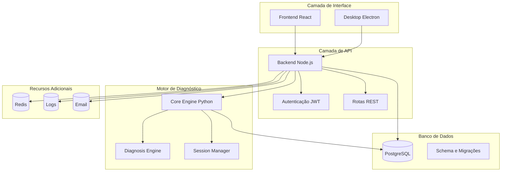

# Introdução ao Projeto

<cite>
**Arquivos Referenciados neste Documento**
- [README.md](file://README.md)
- [App.js](file://frontend/src/App.js)
- [Home.js](file://frontend/src/pages/Home.js)
- [RecoveryFlow.js](file://frontend/src/pages/RecoveryFlow.js)
- [main.js](file://desktop/electron-app/main.js)
- [main.py](file://core-engine/python/main.py)
- [app.js](file://backend/src/app.js)
- [diagnosis.js](file://backend/src/routes/diagnosis.js)
- [sessions.js](file://backend/src/routes/sessions.js)
- [schema.sql](file://database/schema.sql)
- [package.json](file://backend/package.json)
- [package.json](file://frontend/package.json)
- [requirements.txt](file://core-engine/python/requirements.txt)
</cite>

## Sumário
- [Introdução](#introdução)
- [Propósito do Projeto](#propósito-do-projeto)
- [Objetivos Principais](#objetivos-principais)
- [Benefícios para Profissionais de Suporte Técnico](#benefícios-para-profissionais-de-suporte-técnico)
- [Público-Alvo](#público-alvo)
- [Diferenciais Competitivos](#diferenciais-competitivos)
- [Casos de Uso Comuns](#casos-de-uso-comuns)
- [Contexto Histórico](#contexto-histórico)
- [Arquitetura do Sistema](#arquitetura-do-sistema)
- [Conclusão](#conclusão)

## Introdução

O Bay-RSET Tool é um assistente profissional de recuperação de contas Apple ID que oferece soluções técnicas completas para resolver problemas de acesso à conta Apple. Desenvolvido como uma solução de suporte guiado, o sistema segue rigorosamente os processos oficiais da Apple, proporcionando uma experiência segura e legal para profissionais de tecnologia e usuários finais.

O projeto representa uma abordagem moderna e eficiente para resolver um dos problemas mais complexos enfrentados pelos suporte técnico: a recuperação de contas Apple ID bloqueadas, com verificação em duas etapas ou com bloqueio de ativação. Através de um fluxo automatizado e guiado, o sistema orienta os usuários através de procedimentos oficiais, garantindo conformidade legal e segurança.

## Propósito do Projeto

O Bay-RSET Tool foi criado com o objetivo de simplificar e padronizar o processo de recuperação de contas Apple ID para profissionais de suporte técnico. O sistema atua como um assistente inteligente que:

- **Segue processos oficiais**: Todas as recomendações e fluxos seguem os procedimentos oficiais da Apple
- **Garante legalidade**: Não oferece bypass ou métodos ilegais de desbloqueio
- **Promove segurança**: Implementa práticas de segurança rigorosas em todas as etapas
- **Facilita o atendimento**: Reduz o tempo e complexidade das recuperações para os técnicos

O projeto se posiciona como uma solução profissional que combina conhecimento técnico com conformidade legal, oferecendo um valor significativo para empresas de suporte técnico e profissionais independentes.

## Objetivos Principais

### Objetivos Técnicos
- **Automatização de fluxos**: Criar processos automatizados para diagnóstico e recuperação de contas Apple ID
- **Padronização de atendimento**: Estabelecer protocolos uniformes para diferentes tipos de problemas
- **Integração completa**: Conectar frontend, backend e motor de diagnóstico em uma única solução
- **Segurança robusta**: Implementar medidas de proteção de dados e conformidade legal

### Objetivos de Qualidade
- **Experiência do usuário**: Fornecer interface intuitiva e orientação clara para usuários finais
- **Eficiência operacional**: Reduzir tempo médio de resolução de problemas de suporte
- **Conformidade legal**: Garantir que todas as recomendações sigam os processos oficiais da Apple
- **Escalabilidade**: Permitir crescimento e expansão do sistema conforme demanda

## Benefícios para Profissionais de Suporte Técnico

### Para Empresas de Suporte
- **Redução de tempo de atendimento**: Fluxos automatizados aceleram o processo de recuperação
- **Padronização de procedimentos**: Garante consistência nos atendimentos técnicos
- **Melhor experiência do cliente**: Interface clara e orientação passo a passo
- **Documentação legal**: Registros de consentimento e atividades para conformidade

### Para Técnicos Independentes
- **Ferramenta profissional**: Acesso a recursos que antes eram exclusivos de grandes empresas
- **Geração de receita**: Solução comercial que pode ser oferecida como serviço
- **Diferencial competitivo**: Capacidade de resolver casos complexos de recuperação
- **Economia de tempo**: Menos tempo gasto em diagnósticos e buscas de informações

### Para Clientes Finais
- **Acesso a informações oficiais**: Orientações baseadas em procedimentos oficiais da Apple
- **Transparência total**: Processos claros e explicados em cada etapa
- **Segurança garantida**: Métodos legítimos e seguros para recuperação de contas
- **Acompanhamento completo**: Monitoramento em tempo real do progresso do atendimento

## Público-Alvo

### Profissionais de Suporte Técnico
- **Técnicos de help desk** em empresas de tecnologia
- **Desenvolvedores** que atendem a clientes Apple ID
- **Consultores** de suporte técnico especializados
- **Profissionais** de manutenção de equipamentos Apple

### Empresas de Tecnologia
- **Fornecedores de suporte** técnico para dispositivos Apple
- **Agências de TI** que oferecem serviços de recuperação
- **Empresas de manutenção** de equipamentos eletrônicos
- **Organizações** com grandes bases de usuários Apple

### Usuários Finais
- **Pessoas físicas** que perderam acesso ao Apple ID
- **Profissionais** que precisam de suporte para contas corporativas
- **Clientes** de empresas de tecnologia que enfrentam problemas de acesso
- **Usuários** que precisam de orientações legítimas para recuperação

## Diferenciais Competitivos

### Abordagem Legal e Segura
- **Processos oficiais exclusivos**: Baseados apenas em procedimentos oficiais da Apple
- **Compliance total**: Registros de consentimento e atividades para conformidade legal
- **Nenhum bypass**: Nenhuma solução ilegal ou de desbloqueio
- **Transparência absoluta**: Todos os passos são explicados e justificados

### Solução Integrada
- **Arquitetura completa**: Frontend, backend, motor de diagnóstico e desktop app
- **Fluxo unificado**: Processo contínuo desde diagnóstico até recuperação
- **Interface profissional**: Design moderno e funcional para atendimento técnico
- **Multiplataforma**: Funciona em desktop, web e mobile

### Capacidades Técnicas Avançadas
- **Diagnóstico inteligente**: Análise automática de diferentes tipos de problemas
- **Gestão de sessões**: Controle completo de fluxos de recuperação
- **Sistema de tickets**: Gestão de suporte completo com acompanhamento
- **Logs e auditoria**: Rastreamento completo de todas as atividades

### Validação de Comprovantes
- **Verificação de documentos**: Análise de comprovantes de compra para Activation Lock
- **Orientação específica**: Fluxos diferenciados baseados em evidências disponíveis
- **Recomendações personalizadas**: Passos adaptados ao contexto de cada caso

## Casos de Uso Comuns

### Recuperação de Senha Esquecida
**Cenário**: Usuário esqueceu a senha do Apple ID e não consegue acessar suas contas Apple
**Solução**: Fluxo guiado para redefinição de senha através do site oficial iforgot.apple.com
**Tempo estimado**: 15-30 minutos
**Complexidade**: Baixa

### Verificação em Duas Etapas (2FA)
**Cenário**: Usuário tem Apple ID com verificação em duas etapas ativa
**Solução**: Orientações para recuperação através de dispositivos confiáveis e suporte oficial
**Tempo estimado**: 1-3 dias
**Complexidade**: Média

### Bloqueio de Ativação (Activation Lock)
**Cenário**: Dispositivo Apple bloqueado com Activation Lock ativo
**Solução**: Análise de comprovantes de compra e orientações para remoção legal
**Tempo estimado**: 3-7 dias (com comprovante) / Não recuperável (sem comprovante)
**Complexidade**: Alta

### Conta Inacessível
**Cenário**: Apple ID bloqueada temporariamente por motivos de segurança
**Solução**: Fluxo de recuperação baseado nas instruções oficiais da Apple
**Tempo estimado**: 24-48 horas
**Complexidade**: Média

### Dispositivo Comprado Usado
**Cenário**: Compra de dispositivo Apple usado com iCloud ativo
**Solução**: Orientações legais para resolver o problema de propriedade
**Tempo estimado**: Variável
**Complexidade**: Alta

## Contexto Histórico

### Necessidade de Ferramentas Especializadas

A crescente popularidade dos dispositivos Apple e a complexidade crescente dos serviços associados criaram uma demanda significativa por soluções especializadas de recuperação de contas. Os problemas mais comuns incluem:

- **Problemas de acesso**: Senhas esquecidas, bloqueios temporários
- **Verificação em duas etapas**: Dificuldades com dispositivos confiáveis
- **Activation Lock**: Problemas com dispositivos comprados usados
- **Contas bloqueadas**: Por motivos de segurança ou suspeitas

### Evolução dos Métodos Tradicionais

Anteriormente, os técnicos dependiam de:
- **Pesquisas manuais** em sites oficiais da Apple
- **Procedimentos manuais** de verificação e recuperação
- **Documentação desatualizada** e inconsistente
- **Processos lentos** e propensos a erros

### Impacto da Cibersegurança

A evolução da cibersegurança trouxe:
- **Mais proteções** para contas Apple ID
- **Procedimentos mais rigorosos** de verificação
- **Necessidade de métodos legítimos** de recuperação
- **Importância crescente** do compliance legal

## Arquitetura do Sistema

O Bay-RSET Tool implementa uma arquitetura modular e escalável que conecta diferentes componentes para oferecer uma solução completa de recuperação de contas Apple ID.

**Fontes**: 
- [app.js:15-194](file://backend/src/app.js#L15-L194)
- [main.js:246-450](file://core-engine/python/main.py#L246-L450)
- [schema.sql:1-194](file://database/schema.sql#L1-L194)

### Componentes Principais

#### Frontend React
- Interface web moderna e responsiva
- Componentes reutilizáveis e bem organizados
- Integração com backend via API REST
- Design intuitivo para atendimento técnico

#### Backend Node.js
- Servidor Express com middleware de segurança
- Autenticação JWT e proteção contra ataques
- Rotas REST para todos os recursos do sistema
- Integração com Core Engine Python

#### Core Engine Python
- Motor de diagnóstico avançado
- Lógica de negócio central
- Gestão de sessões e fluxos
- Validação de comprovantes e documentos

#### Banco de Dados PostgreSQL
- Modelagem completa de entidades
- Índices otimizados para performance
- Triggers automáticos para atualização de timestamps
- Estrutura escalável para crescimento

## Conclusão

O Bay-RSET Tool representa uma solução inovadora e completa para o desafio crescente de recuperação de contas Apple ID. Ao seguir rigorosamente os processos oficiais da Apple e oferecer uma abordagem legal e segura, o sistema se destaca como uma ferramenta essencial para profissionais de suporte técnico.

A combinação de tecnologia avançada, interface intuitiva e conformidade legal cria um valor significativo para empresas de tecnologia, técnicos independentes e organizações que precisam de soluções profissionais para resolver problemas complexos de acesso a contas Apple ID.

Com sua arquitetura modular e recursos avançados, o Bay-RSET Tool está preparado para atender às crescentes demandas do mercado de suporte técnico e se consolidar como referência no setor de recuperação de contas Apple ID.