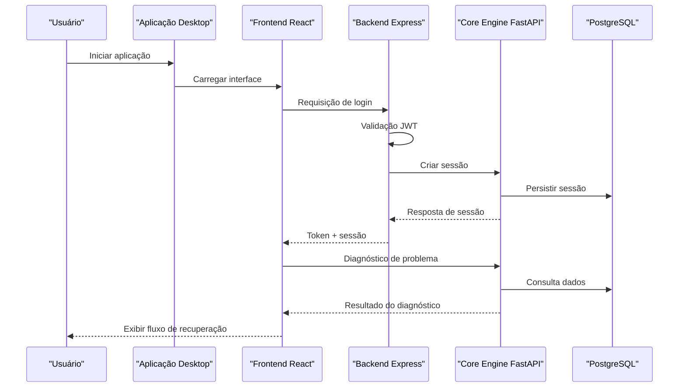
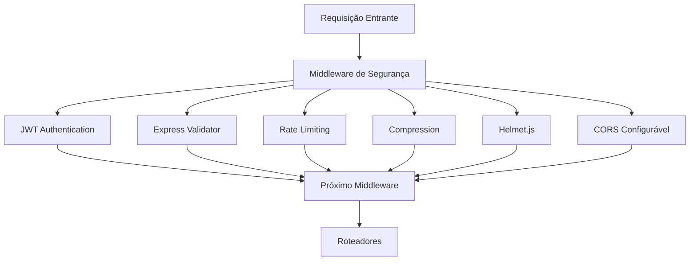
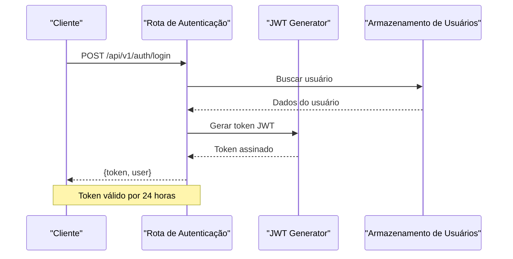
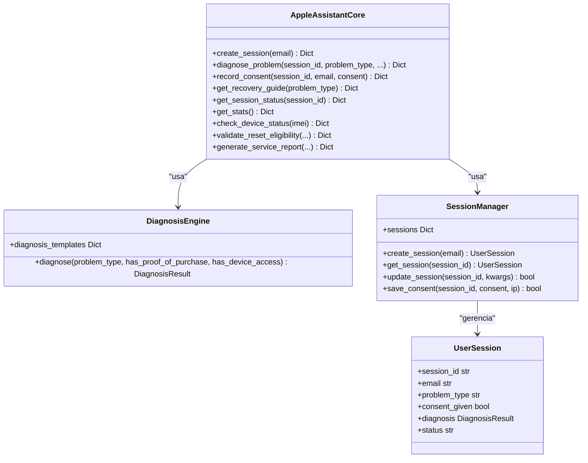
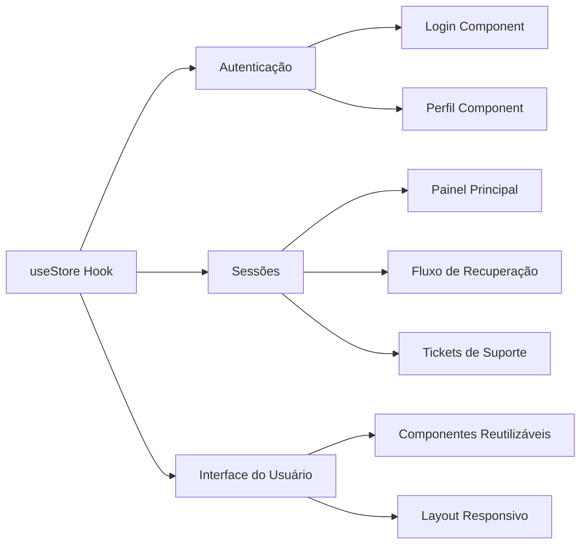
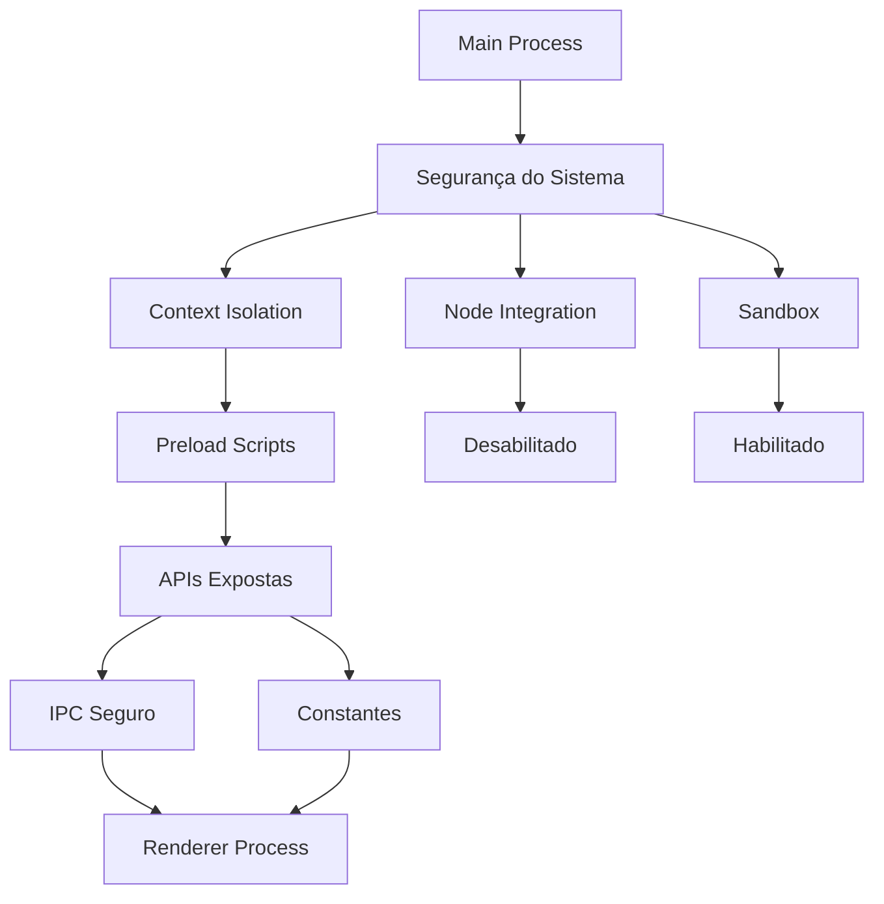

# Pilha Tecnológica

<cite>
**Arquivos referenciados neste documento**
- [README.md](file://README.md)
- [backend/package.json](file://backend/package.json)
- [backend/src/app.js](file://backend/src/app.js)
- [backend/src/routes/auth.js](file://backend/src/routes/auth.js)
- [backend/src/routes/sessions.js](file://backend/src/routes/sessions.js)
- [core-engine/python/requirements.txt](file://core-engine/python/requirements.txt)
- [core-engine/python/main.py](file://core-engine/python/main.py)
- [core-engine/bridge/api.py](file://core-engine/bridge/api.py)
- [frontend/package.json](file://frontend/package.json)
- [frontend/src/App.js](file://frontend/src/App.js)
- [frontend/src/services/api.js](file://frontend/src/services/api.js)
- [frontend/src/pages/Dashboard.js](file://frontend/src/pages/Dashboard.js)
- [desktop/electron-app/package.json](file://desktop/electron-app/package.json)
- [desktop/electron-app/main.js](file://desktop/electron-app/main.js)
- [desktop/electron-app/preload.js](file://desktop/electron-app/preload.js)
- [desktop/electron-app/renderer/app.js](file://desktop/electron-app/renderer/app.js)
- [database/schema.sql](file://database/schema.sql)
</cite>

## Sumário
1. [Introdução](#introdução)
2. [Estrutura do Projeto](#estrutura-do-projeto)
3. [Componentes Principais](#componentes-principais)
4. [Visão Geral da Arquitetura](#visão-geral-da-arquitetura)
5. [Análise Detalhada dos Componentes](#análise-detalhada-dos-componentes)
6. [Análise de Dependências](#análise-de-dependências)
7. [Considerações de Desempenho](#considerações-de-desempenho)
8. [Guia de Solução de Problemas](#guia-de-solução-de-problemas)
9. [Conclusão](#conclusão)

## Introdução
O Bay-RSET Tool é um assistente de recuperação Apple ID profissional com arquitetura modular composta por camadas tecnológicas bem definidas. O sistema oferece suporte guiado para recuperação de contas Apple, incluindo senhas esquecidas, verificação em duas etapas, bloqueio de ativação e acompanhamento de tickets de suporte. A pilha tecnológica foi projetada para proporcionar segurança, escalabilidade e experiência de usuário consistente tanto em ambientes web quanto desktop.

## Estrutura do Projeto
O projeto segue uma estrutura de camadas claramente separadas, cada uma com responsabilidades específicas:

```mermaid
graph TB
subgraph "Camada Desktop"
Desktop[Aplicação Electron]
Renderer[Renderer Process]
MainProc[Main Process]
end
subgraph "Camada Frontend"
React[React SPA]
Services[API Services]
Store[State Management]
end
subgraph "Camada Backend"
Express[Express Server]
Routes[Roteadores]
Auth[Autenticação]
Sessions[Sessões]
end
subgraph "Camada Core Engine"
FastAPI[FastAPI Server]
Core[Core Engine]
Bridge[Ponte API]
end
subgraph "Camada de Dados"
PostgreSQL[PostgreSQL]
Redis[Redis (opcional)]
end
Desktop --> React
React --> Express
Express --> FastAPI
FastAPI --> PostgreSQL
Express --> Redis
Desktop --> FastAPI
```

**Fontes**
- [README.md:19-29](file://README.md#L19-L29)

## Componentes Principais

### Backend (Node.js/Express)
O backend é construído com Node.js e Express, fornecendo uma API REST robusta com middleware de segurança e gerenciamento de sessões. As principais características incluem:

- **Middleware de Segurança**: Helmet.js, CORS configurável, rate limiting
- **Autenticação**: JWT com validação de tokens
- **Logs**: Winston para logging estruturado
- **Documentação**: Rotas de health check e documentação da API
- **Integração**: Comunicação com o Core Engine via HTTP

**Fontes**
- [backend/src/app.js:15-54](file://backend/src/app.js#L15-L54)
- [backend/src/app.js:98-144](file://backend/src/app.js#L98-L144)
- [backend/package.json:23-47](file://backend/package.json#L23-L47)

### Core Engine (Python/FastAPI)
O motor central do sistema é implementado em Python com FastAPI, oferecendo:

- **Diagnóstico Inteligente**: Algoritmos avançados para análise de problemas
- **Gestão de Sessões**: Controle completo de fluxos de usuário
- **API REST Completa**: Endpoints para sessões, diagnósticos e relatórios
- **WebSocket**: Comunicação em tempo real para atualizações dinâmicas
- **Validação de Dados**: Pydantic para garantir integridade de dados

**Fontes**
- [core-engine/bridge/api.py:164-170](file://core-engine/bridge/api.py#L164-L170)
- [core-engine/python/main.py:263-354](file://core-engine/python/main.py#L263-L354)
- [core-engine/python/requirements.txt:8-9](file://core-engine/python/requirements.txt#L8-L9)

### Frontend (React)
A interface web é desenvolvida com React e oferece:

- **SPA Completa**: Navegação sem reloads
- **Gerenciamento de Estado**: Zustand para estado global
- **Queries Assíncronas**: React Query para cache e sincronização
- **Design Moderno**: TailwindCSS com componentes reutilizáveis
- **Rotas Protegidas**: Componentes de proteção de acesso

**Fontes**
- [frontend/src/App.js:24-32](file://frontend/src/App.js#L24-L32)
- [frontend/package.json:5-25](file://frontend/package.json#L5-L25)

### Desktop (Electron)
A camada desktop utiliza Electron para criar uma aplicação desktop nativa:

- **Segurança Aprimorada**: Context isolation e preload scripts
- **IPC Seguro**: Comunicação controlada entre processos
- **Atualizações Automáticas**: Electron updater integrado
- **Navegação Controlada**: Restrição de links externos
- **Logging Local**: Registro de ações do usuário

**Fontes**
- [desktop/electron-app/main.js:22-79](file://desktop/electron-app/main.js#L22-L79)
- [desktop/electron-app/preload.js:4-29](file://desktop/electron-app/preload.js#L4-L29)

### Banco de Dados (PostgreSQL)
O sistema utiliza PostgreSQL como principal mecanismo de persistência:

- **Modelagem Completa**: Tabelas para usuários, sessões, tickets e logs
- **Tipos Avançados**: UUID, JSONB para dados estruturados
- **Índices otimizados**: Para melhor performance de consultas
- **Triggers**: Para manutenção automática de timestamps
- **Extensões**: UUID extension para geração automática de IDs

**Fontes**
- [database/schema.sql:8-51](file://database/schema.sql#L8-L51)
- [database/schema.sql:144-156](file://database/schema.sql#L144-L156)

## Visão Geral da Arquitetura



**Fontes**
- [backend/src/routes/sessions.js:56-87](file://backend/src/routes/sessions.js#L56-L87)
- [core-engine/bridge/api.py:213-231](file://core-engine/bridge/api.py#L213-L231)

## Análise Detalhada dos Componentes

### Backend API (Node.js/Express)

#### Segurança e Middleware
O backend implementa múltiplas camadas de segurança:



**Fontes**
- [backend/src/app.js:59-96](file://backend/src/app.js#L59-L96)
- [backend/src/routes/auth.js:25-42](file://backend/src/routes/auth.js#L25-L42)

#### Autenticação JWT
O sistema utiliza autenticação JWT com tokens de 24 horas de validade:



**Fontes**
- [backend/src/routes/auth.js:79-83](file://backend/src/routes/auth.js#L79-L83)
- [backend/src/routes/auth.js:127-131](file://backend/src/routes/auth.js#L127-L131)

### Core Engine (Python/FastAPI)

#### Diagnóstico Inteligente
O Core Engine implementa um motor de diagnóstico avançado:



**Fontes**
- [core-engine/python/main.py:263-354](file://core-engine/python/main.py#L263-L354)
- [core-engine/python/main.py:76-213](file://core-engine/python/main.py#L76-L213)
- [core-engine/python/main.py:215-261](file://core-engine/python/main.py#L215-L261)

#### API REST Completa
O Core Engine expõe uma API REST completa com endpoints para todos os recursos:

**Fontes**
- [core-engine/bridge/api.py:184-200](file://core-engine/bridge/api.py#L184-L200)
- [core-engine/bridge/api.py:213-231](file://core-engine/bridge/api.py#L213-L231)
- [core-engine/bridge/api.py:285-318](file://core-engine/bridge/api.py#L285-L318)

### Frontend React

#### Gerenciamento de Estado
O frontend utiliza Zustand para gerenciamento de estado global:



**Fontes**
- [frontend/src/App.js:24-32](file://frontend/src/App.js#L24-L32)
- [frontend/src/services/api.js:16-27](file://frontend/src/services/api.js#L16-L27)

#### Componentes Protegidos
O sistema implementa rotas protegidas com validação de token:

**Fontes**
- [frontend/src/App.js:18-19](file://frontend/src/App.js#L18-L19)
- [frontend/src/services/api.js:30-40](file://frontend/src/services/api.js#L30-L40)

### Desktop Electron

#### Segurança e Isolamento
A aplicação desktop implementa múltiplas camadas de segurança:



**Fontes**
- [desktop/electron-app/main.js:31-37](file://desktop/electron-app/main.js#L31-L37)
- [desktop/electron-app/preload.js:4-29](file://desktop/electron-app/preload.js#L4-L29)

#### Fluxo de Diagnóstico
O fluxo completo de diagnóstico no desktop:

**Fontes**
- [desktop/electron-app/renderer/app.js:245-280](file://desktop/electron-app/renderer/app.js#L245-L280)
- [desktop/electron-app/renderer/app.js:372-389](file://desktop/electron-app/renderer/app.js#L372-L389)

## Análise de Dependências

### Versões Mínimas Recomendadas

#### Backend (Node.js)
- **Node.js**: >= 18.0.0 (recomendado >= 18.17.0)
- **npm**: >= 9.0.0
- **Express**: ^4.18.2
- **JWT**: ^9.0.2

#### Core Engine (Python)
- **Python**: >= 3.8.0
- **FastAPI**: >= 0.109.0
- **Uvicorn**: >= 0.27.0
- **Pydantic**: >= 2.5.0

#### Frontend (React)
- **React**: ^18.2.0
- **Node.js**: >= 16.0.0
- **npm**: >= 8.0.0

#### Desktop (Electron)
- **Electron**: ^42.0.0
- **Node.js**: >= 18.0.0

#### Banco de Dados
- **PostgreSQL**: >= 14.0
- **Redis**: >= 5.0 (opcional)

**Fontes**
- [README.md:35-38](file://README.md#L35-L38)
- [backend/package.json:54-57](file://backend/package.json#L54-L57)
- [core-engine/python/requirements.txt:2](file://core-engine/python/requirements.txt#L2)

### Dependências Principais

#### Backend
- **Express**: Framework web
- **JWT**: Autenticação
- **Winston**: Logging
- **Helmet**: Segurança
- **Cors**: Compartilhamento de recursos
- **Express-validator**: Validação de dados

#### Core Engine
- **FastAPI**: Framework ASGI
- **Pydantic**: Validação de dados
- **HTTPX**: Client HTTP
- **Structlog**: Logging estruturado

#### Frontend
- **React**: Biblioteca de interface
- **Zustand**: Gerenciamento de estado
- **React Query**: Gerenciamento de queries
- **Axios**: Requisições HTTP

#### Desktop
- **Electron**: Framework desktop
- **Electron updater**: Atualizações automáticas
- **Socket.io-client**: Comunicação em tempo real

**Fontes**
- [backend/package.json:23-47](file://backend/package.json#L23-L47)
- [core-engine/python/requirements.txt:8-27](file://core-engine/python/requirements.txt#L8-L27)
- [frontend/package.json:5-25](file://frontend/package.json#L5-L25)
- [desktop/electron-app/package.json:22-33](file://desktop/electron-app/package.json#L22-L33)

## Considerações de Desempenho

### Escalabilidade
- **Backend**: Configuração de rate limiting para proteger endpoints críticos
- **Core Engine**: Uso de FastAPI para alta performance ASGI
- **Frontend**: React Query para cache eficiente de dados
- **Banco de Dados**: Índices otimizados e consultas parametrizadas

### Otimizações Implementadas
- **Compression**: Middleware gzip para redução de tráfego
- **Caching**: React Query com staleTime configurado
- **Lazy Loading**: Componentes React carregados sob demanda
- **Connection Pooling**: Configuração otimizada para PostgreSQL

### Monitoramento
- **Logging Estruturado**: Winston para métricas de desempenho
- **Health Checks**: Endpoints para verificação de integridade
- **Analytics**: Registro de ações do usuário para análise

## Guia de Solução de Problemas

### Erros Comuns e Soluções

#### Erros de Autenticação
- **Credenciais Inválidas**: Verificar token JWT e credenciais
- **Token Expirado**: Implementar refresh token
- **Acesso Negado**: Verificar permissões de usuário

#### Erros de Conexão
- **Core Engine Offline**: Verificar URL de conexão e firewall
- **Banco de Dados**: Verificar strings de conexão e permissões
- **Frontend**: Verificar proxy e CORS

#### Erros de Diagnóstico
- **Sessão Inválida**: Verificar ID da sessão e tempo de expiração
- **Dados Insuficientes**: Validar parâmetros de diagnóstico
- **Problema Não Reconhecido**: Verificar tipos de problema válidos

**Fontes**
- [backend/src/routes/auth.js:110-119](file://backend/src/routes/auth.js#L110-L119)
- [backend/src/routes/sessions.js:175-206](file://backend/src/routes/sessions.js#L175-L206)

### Diagnóstico de Desempenho

#### Métricas de Desempenho
- **Tempo de Resposta**: Monitorar endpoints críticos
- **Taxa de Erro**: Acompanhar taxas de erro por endpoint
- **Uso de Memória**: Verificar consumo de memória do backend
- **Conexões Ativas**: Monitorar conexões ao banco de dados

#### Logs e Auditoria
- **Níveis de Log**: Debug, Info, Warning, Error
- **Auditoria de Ações**: Todos os eventos importantes registrados
- **Consentimentos**: Registro completo de consentimentos legais

**Fontes**
- [backend/src/app.js:35-54](file://backend/src/app.js#L35-L54)
- [core-engine/bridge/api.py:529-539](file://core-engine/bridge/api.py#L529-L539)

## Conclusão
A pilha tecnológica do Bay-RSET Tool foi cuidadosamente projetada para oferecer uma solução completa de assistência de recuperação Apple ID. A combinação de Node.js/Express para backend, Python/FastAPI para o motor central, React para frontend, Electron para desktop e PostgreSQL para persistência cria uma arquitetura robusta, escalável e segura.

As escolhas tecnológicas priorizam:
- **Segurança**: JWT, Helmet, CORS e validações rigorosas
- **Experiência do Usuário**: Interface responsiva e fluxos intuitivos
- **Manutenibilidade**: Código modular e boas práticas de desenvolvimento
- **Performance**: Otimizações e monitoramento contínuo

A estrutura modular permite fácil expansão e manutenção, enquanto as camadas de segurança garantem conformidade legal e proteção de dados sensíveis.