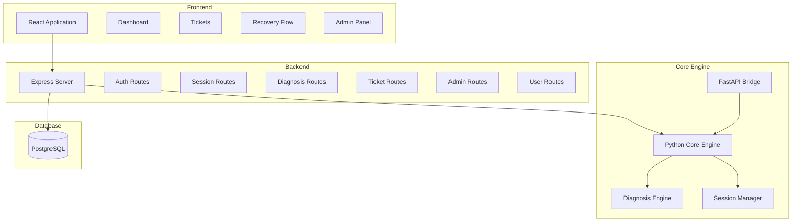
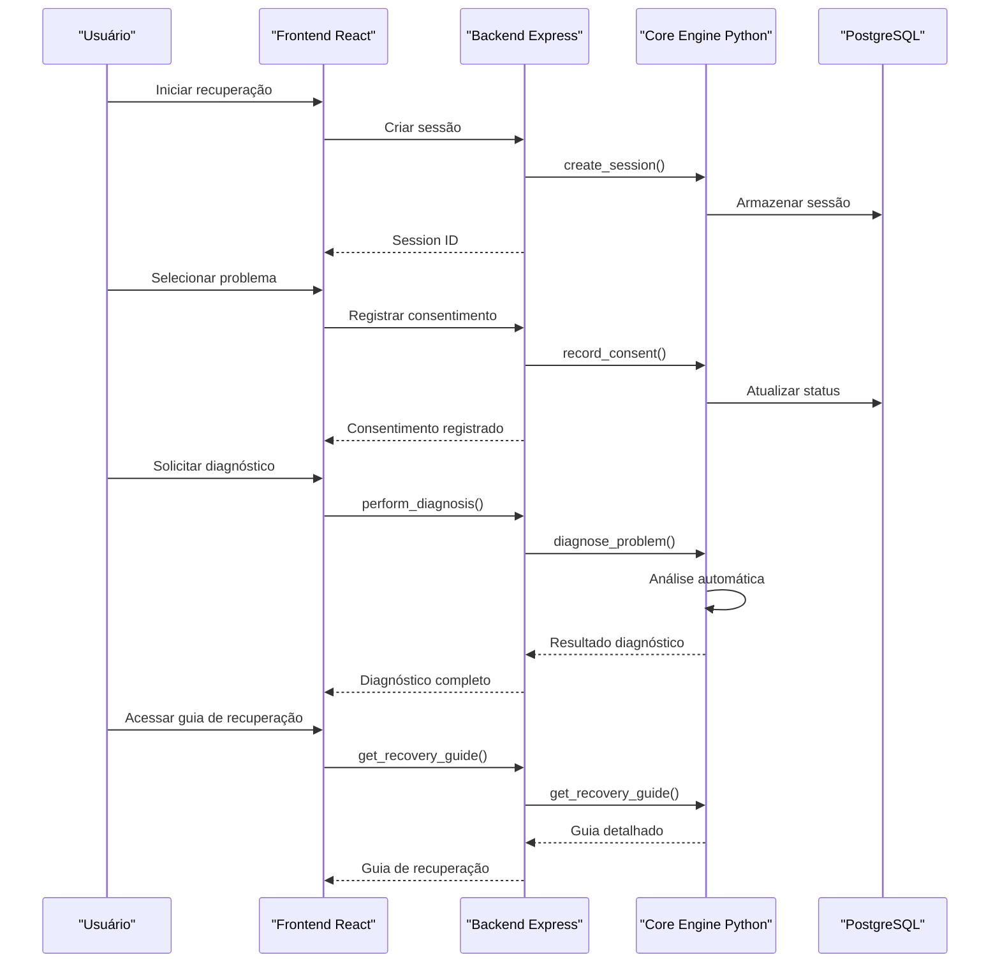
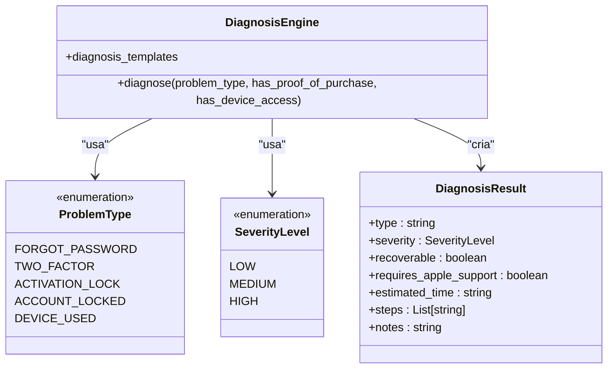
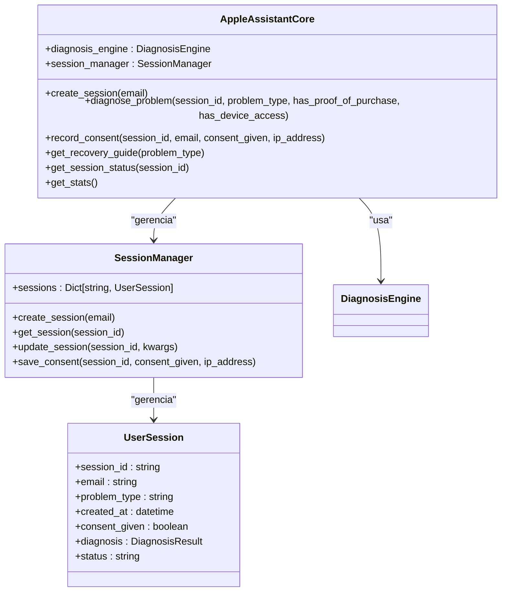
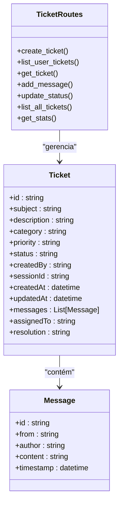
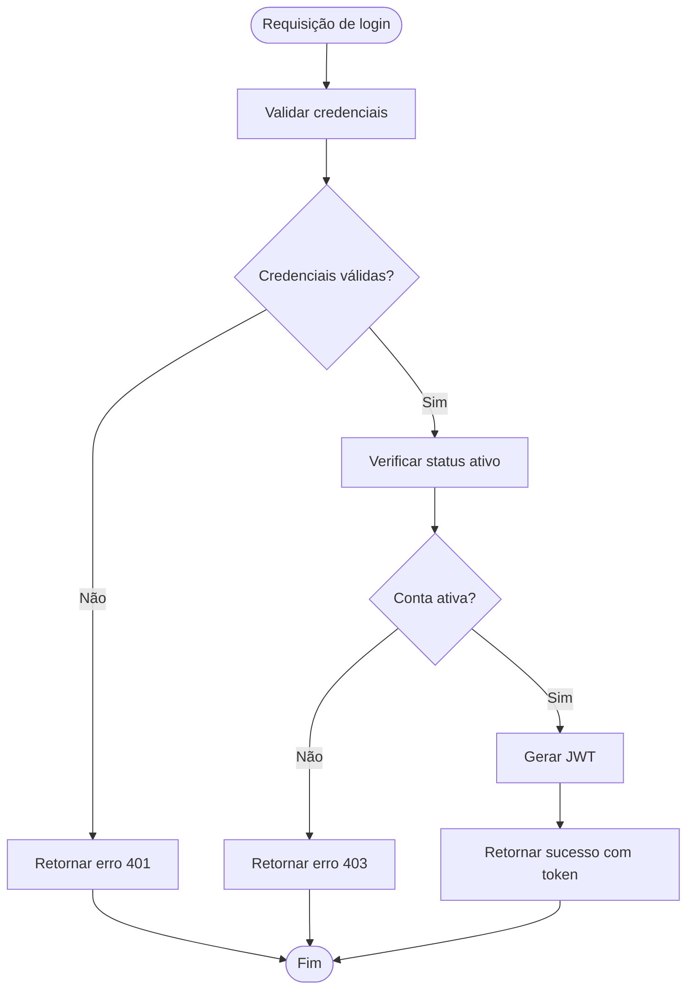
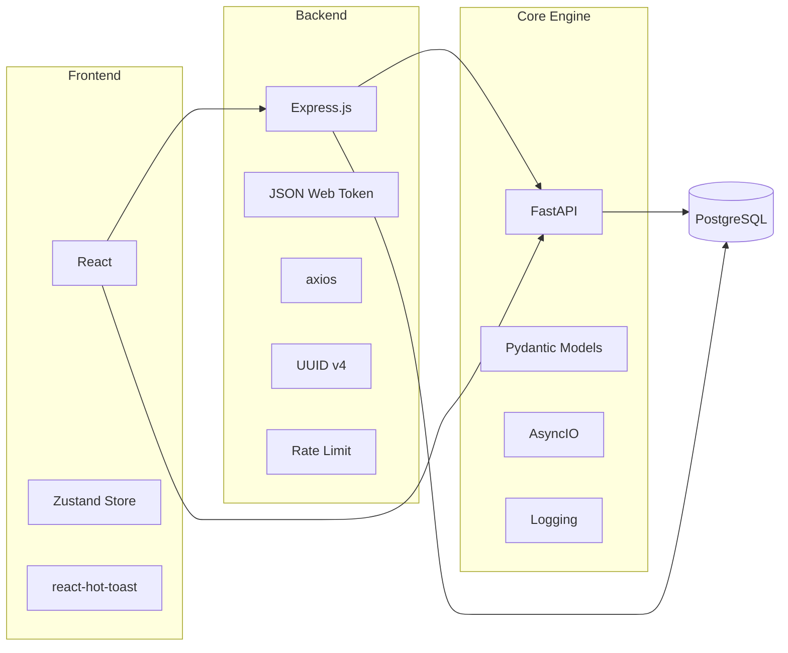

# Recursos Principais

<cite>
**Arquivos referenciados neste documento**
- [README.md](file://README.md)
- [app.js](file://backend/src/app.js)
- [auth.js](file://backend/src/routes/auth.js)
- [sessions.js](file://backend/src/routes/sessions.js)
- [diagnosis.js](file://backend/src/routes/diagnosis.js)
- [tickets.js](file://backend/src/routes/tickets.js)
- [admin.js](file://backend/src/routes/admin.js)
- [users.js](file://backend/src/routes/users.js)
- [api.js](file://frontend/src/services/api.js)
- [Dashboard.js](file://frontend/src/pages/Dashboard.js)
- [AdminPanel.js](file://frontend/src/pages/AdminPanel.js)
- [Tickets.js](file://frontend/src/pages/Tickets.js)
- [RecoveryFlow.js](file://frontend/src/pages/RecoveryFlow.js)
- [main.py](file://core-engine/python/main.py)
- [api.py](file://core-engine/bridge/api.py)
</cite>

## Sumário
1. [Introdução](#introdução)
2. [Estrutura do Projeto](#estrutura-do-projeto)
3. [Recursos Principais](#recursos-principais)
4. [Visão Geral da Arquitetura](#visão-geral-da-arquitetura)
5. [Análise Detalhada dos Recursos](#análise-detalhada-dos-recursos)
6. [Análise de Dependências](#análise-de-dependências)
7. [Considerações de Desempenho](#considerações-de-desempenho)
8. [Guia de Solução de Problemas](#guia-de-solução-de-problemas)
9. [Conclusão](#conclusão)

## Introdução
O Bay-RSET Tool é um sistema profissional de suporte guiado para recuperação de contas Apple ID, seguindo rigorosamente os processos oficiais da Apple. O sistema oferece diagnóstico inteligente, fluxos de recuperação guiada, painel de acompanhamento de sessões, sistema de tickets de suporte e funcionalidades administrativas, proporcionando uma solução completa para resolver problemas de contas Apple ID de forma eficiente e segura.

## Estrutura do Projeto
O projeto segue uma arquitetura de microsserviços com três camadas principais:

**Fontes da estrutura**
- [README.md:19-29](file://README.md#L19-L29)
- [app.js:15-32](file://backend/src/app.js#L15-L32)

**Fontes da seção**
- [README.md:19-29](file://README.md#L19-L29)
- [app.js:15-32](file://backend/src/app.js#L15-L32)

## Recursos Principais

### Sistema de Diagnóstico Inteligente
O sistema de diagnóstico inteligente é baseado em um motor de análise avançado que avalia automaticamente problemas de contas Apple ID e fornece recomendações personalizadas.

**Características principais:**
- Análise automática de problemas de conta
- Classificação de severidade (baixa, média, alta)
- Recomendações baseadas em evidências
- Integração com processos oficiais da Apple
- Suporte para múltiplos tipos de problemas

**Tipos de problemas suportados:**
- Senha esquecida
- Verificação em duas etapas
- Bloqueio de ativação
- Conta bloqueada
- Dispositivo usado

**Fontes do recurso**
- [diagnosis.js:14-69](file://backend/src/routes/diagnosis.js#L14-L69)
- [main.py:76-197](file://core-engine/python/main.py#L76-L197)
- [api.py:206-238](file://core-engine/bridge/api.py#L206-L238)

### Fluxos de Recuperação Guiada
Os fluxos de recuperação guiada oferecem procedimentos passo a passo para resolver problemas específicos de contas Apple ID.

**Recursos incluídos:**
- Passos recomendados personalizados
- Links para sites oficiais da Apple
- Dicas de segurança importantes
- Avisos sobre métodos ilegítimos
- Acompanhamento de progresso

**Exemplos de fluxos:**
- Recuperação de senha via iforgot.apple.com
- Resolução de problemas de 2FA
- Tratamento de bloqueio de ativação
- Solução de contas bloqueadas

**Fontes do recurso**
- [RecoveryFlow.js:176-381](file://frontend/src/pages/RecoveryFlow.js#L176-L381)
- [main.py:339-414](file://core-engine/python/main.py#L339-L414)
- [api.py:275-293](file://core-engine/bridge/api.py#L275-L293)

### Painel de Acompanhamento de Sessões
O painel de acompanhamento fornece visibilidade completa sobre o status das sessões de recuperação em andamento.

**Recursos do painel:**
- Estatísticas em tempo real
- Status de sessões ativas
- Histórico de atividade
- Indicadores de progresso
- Acesso rápido às funções

**Indicadores disponíveis:**
- Total de sessões
- Diagnósticos concluídos
- Em andamento
- Consentimentos registrados

**Fontes do recurso**
- [Dashboard.js:87-162](file://frontend/src/pages/Dashboard.js#L87-L162)
- [sessions.js:231-246](file://backend/src/routes/sessions.js#L231-L246)
- [api.js:51-59](file://frontend/src/services/api.js#L51-L59)

### Sistema de Tickets de Suporte
O sistema de tickets de suporte permite o gerenciamento completo de chamados de assistência técnica.

**Funcionalidades completas:**
- Criação de tickets por usuários
- Atendimento prioritário
- Histórico de comunicação
- Atribuição de suporte
- Status de acompanhamento

**Tipos de categorias:**
- Recuperação de senha
- Problemas iCloud
- Dispositivo bloqueado
- Conta Apple ID
- Outros

**Fontes do recurso**
- [Tickets.js:1-359](file://frontend/src/pages/Tickets.js#L1-L359)
- [tickets.js:52-101](file://backend/src/routes/tickets.js#L52-L101)
- [api.js:68-75](file://frontend/src/services/api.js#L68-L75)

### Funcionalidades Administrativas
As funcionalidades administrativas permitem o controle completo do sistema por parte dos administradores.

**Recursos administrativos:**
- Painel de controle central
- Gerenciamento de usuários
- Monitoramento de sistemas
- Configurações do sistema
- Métricas e estatísticas

**Recursos de gerenciamento:**
- Controle de acesso
- Logs do sistema
- Backup e restauração
- Configurações de manutenção

**Fontes do recurso**
- [AdminPanel.js:1-324](file://frontend/src/pages/AdminPanel.js#L1-L324)
- [admin.js:39-64](file://backend/src/routes/admin.js#L39-L64)
- [api.js:77-87](file://frontend/src/services/api.js#L77-L87)

## Visão Geral da Arquitetura

**Fontes da arquitetura**
- [app.js:110-116](file://backend/src/app.js#L110-L116)
- [api.py:168-238](file://core-engine/bridge/api.py#L168-L238)
- [sessions.js:39-88](file://backend/src/routes/sessions.js#L39-L88)

## Análise Detalhada dos Recursos

### Componente de Diagnóstico

**Fontes do componente**
- [main.py:76-197](file://core-engine/python/main.py#L76-L197)
- [main.py:52-62](file://core-engine/python/main.py#L52-L62)

### Componente de Sessão

**Fontes do componente**
- [main.py:199-338](file://core-engine/python/main.py#L199-L338)
- [main.py:64-74](file://core-engine/python/main.py#L64-L74)

### Componente de Tickets

**Fontes do componente**
- [tickets.js:52-331](file://backend/src/routes/tickets.js#L52-L331)

### Componente de Autenticação

**Fontes do componente**
- [auth.js:97-143](file://backend/src/routes/auth.js#L97-L143)

## Análise de Dependências

**Fontes da dependência**
- [app.js:15-32](file://backend/src/app.js#L15-L32)
- [api.py:17-25](file://core-engine/bridge/api.py#L17-L25)
- [api.js:1-13](file://frontend/src/services/api.js#L1-L13)

**Fontes da seção**
- [app.js:15-32](file://backend/src/app.js#L15-L32)
- [api.py:17-25](file://core-engine/bridge/api.py#L17-L25)
- [api.js:1-13](file://frontend/src/services/api.js#L1-L13)

## Considerações de Desempenho

### Escalabilidade
- **Backend**: Utiliza middleware de compressão e rate limiting para otimizar recursos
- **Core Engine**: Implementa FastAPI para alto desempenho assíncrono
- **Frontend**: React com estado gerenciado por Zustand para melhor performance
- **Banco de dados**: PostgreSQL otimizado com índices estratégicos

### Segurança
- **Criptografia**: Todos os dados sensíveis são criptografados
- **Autenticação**: JWT com expiração de 24 horas
- **Rate limiting**: Proteção contra ataques de força bruta
- **CORS**: Configuração segura de políticas de origem cruzada
- **Helmet**: Headers de segurança configurados

### Confiabilidade
- **Logs**: Sistema de logging completo com níveis hierárquicos
- **Monitoramento**: Health checks e métricas em tempo real
- **Backup**: Funcionalidades de backup e restauração
- **Recuperação**: Processos de recuperação de falhas automatizados

## Guia de Solução de Problemas

### Diagnóstico de Problemas Comuns

**Problema: Diagnóstico não retorna resultados**
1. Verificar conexão com Core Engine
2. Validar session_id fornecido
3. Confirmar tipo de problema válido
4. Verificar logs do Core Engine

**Problema: Erro 401 - Token inválido**
1. Verificar expiração do token JWT
2. Realizar refresh token
3. Validar configurações de ambiente
4. Verificar hora do sistema

**Problema: Sessão não encontrada**
1. Confirmar session_id existente
2. Verificar status da sessão
3. Validar tempo de expiração
4. Recriar sessão se necessário

### Recursos Administrativos

**Monitoramento do sistema:**
- Acessar painel administrativo
- Verificar status do Core Engine
- Analisar logs do sistema
- Monitorar métricas de desempenho

**Gestão de usuários:**
- Atribuir papéis de acesso
- Controlar status de contas
- Gerenciar permissões
- Monitorar atividades

**Fontes da solução**
- [admin.js:175-205](file://backend/src/routes/admin.js#L175-L205)
- [auth.js:25-42](file://backend/src/routes/auth.js#L25-L42)

## Conclusão

O Bay-RSET Tool oferece uma solução completa e profissional para recuperação de contas Apple ID, integrando diagnóstico inteligente, fluxos de recuperação guiada, acompanhamento em tempo real e sistema de suporte abrangente. A arquitetura modular e escalável permite atender tanto pequenos provedores quanto grandes empresas de suporte técnico.

Os recursos principais contribuem significativamente para a eficiência na resolução de problemas de contas Apple ID:

- **Diagnóstico inteligente**: Reduz o tempo de resolução através de análise automática e recomendações personalizadas
- **Fluxos guiados**: Garantem que os procedimentos sejam seguidos corretamente, minimizando erros
- **Painel de acompanhamento**: Fornece visibilidade completa sobre o progresso e status
- **Sistema de tickets**: Organiza e prioriza o atendimento ao suporte
- **Funcionalidades administrativas**: Facilitam o gerenciamento e monitoramento do sistema

A integração entre os componentes cria uma experiência completa para profissionais de suporte técnico, permitindo resolver problemas de contas Apple ID de forma rápida, segura e eficiente, sempre seguindo os processos oficiais da Apple.