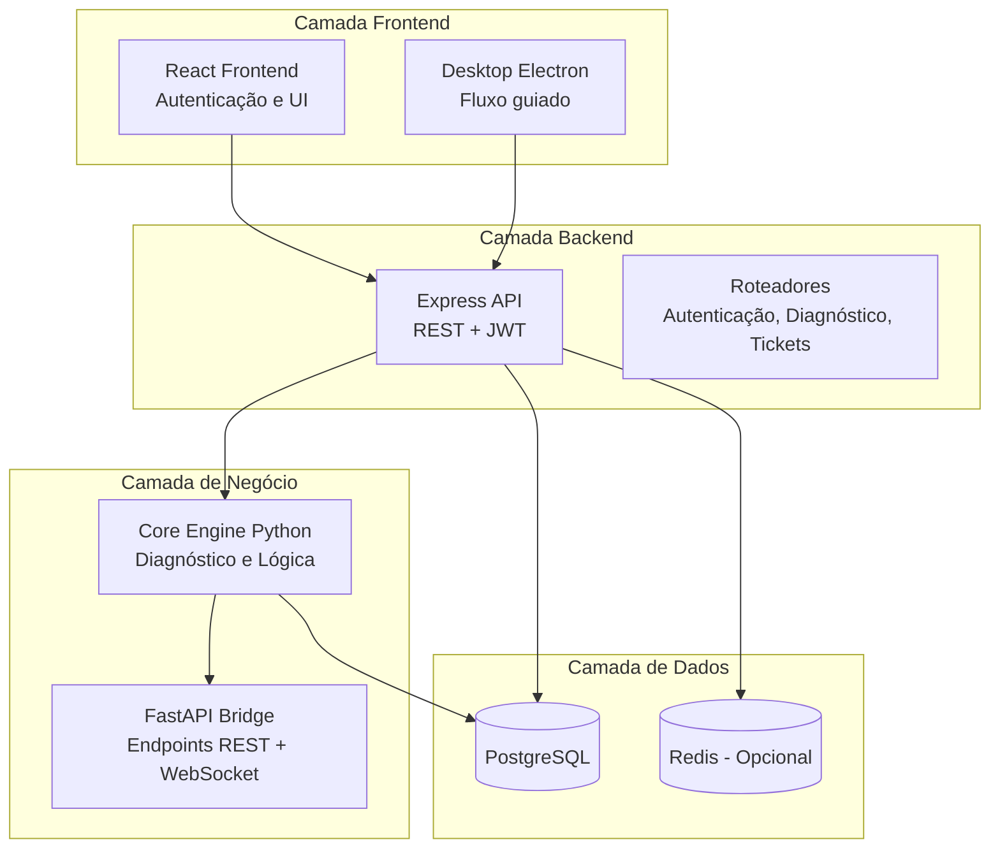
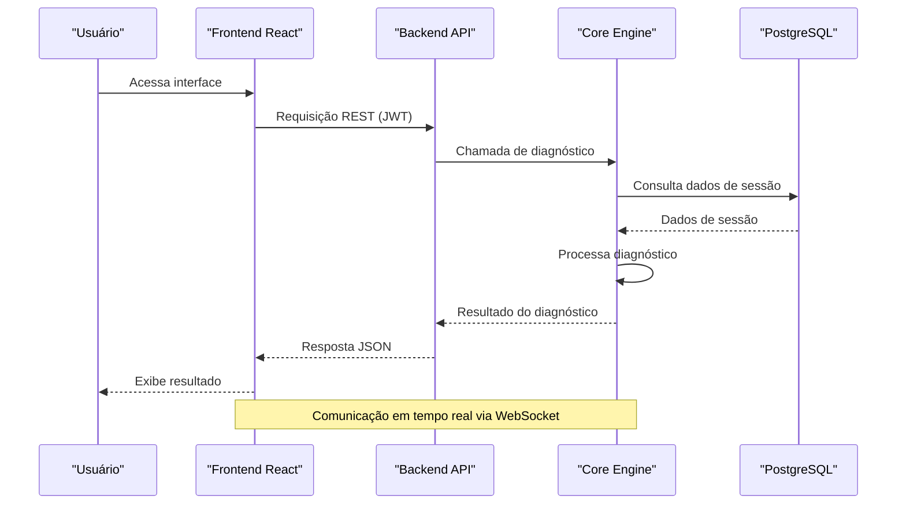
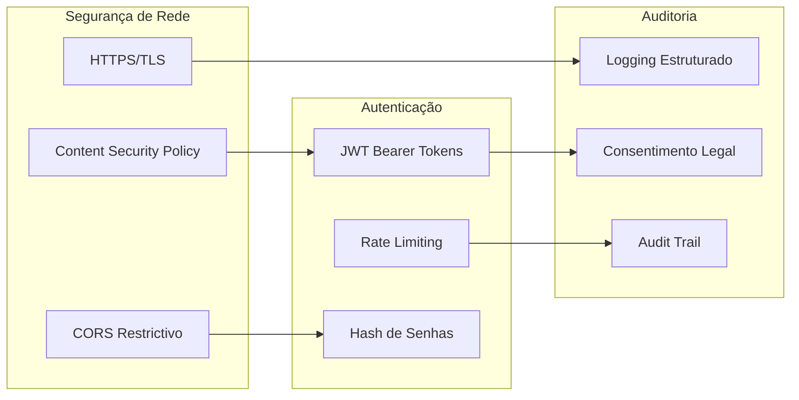
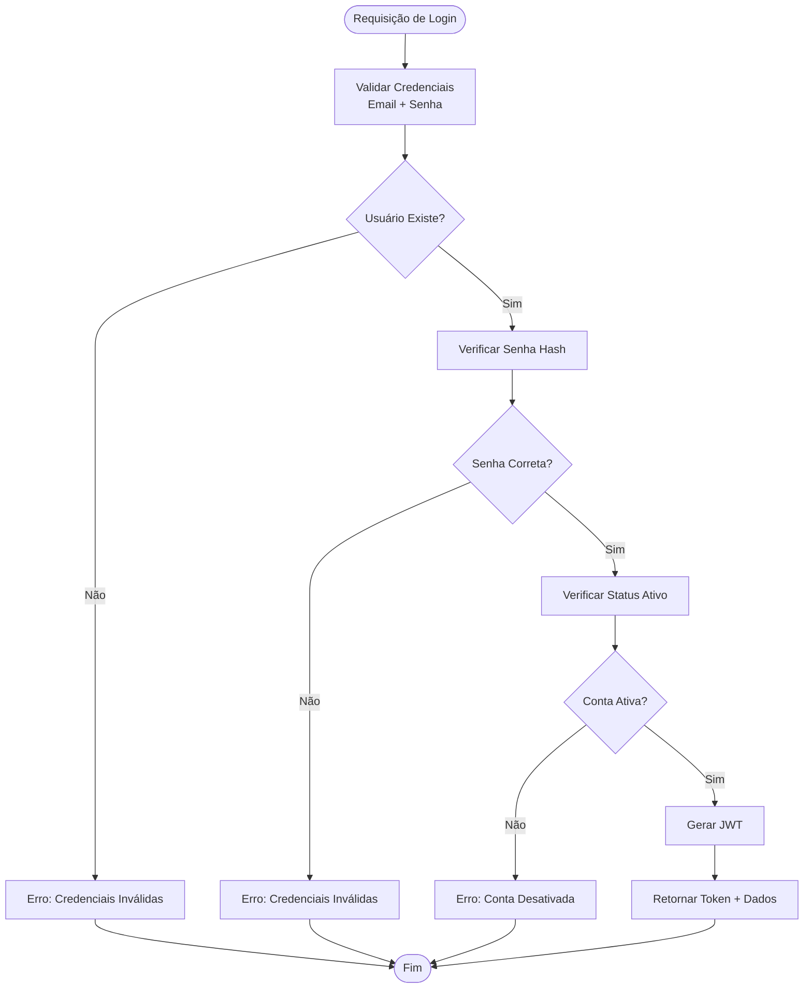
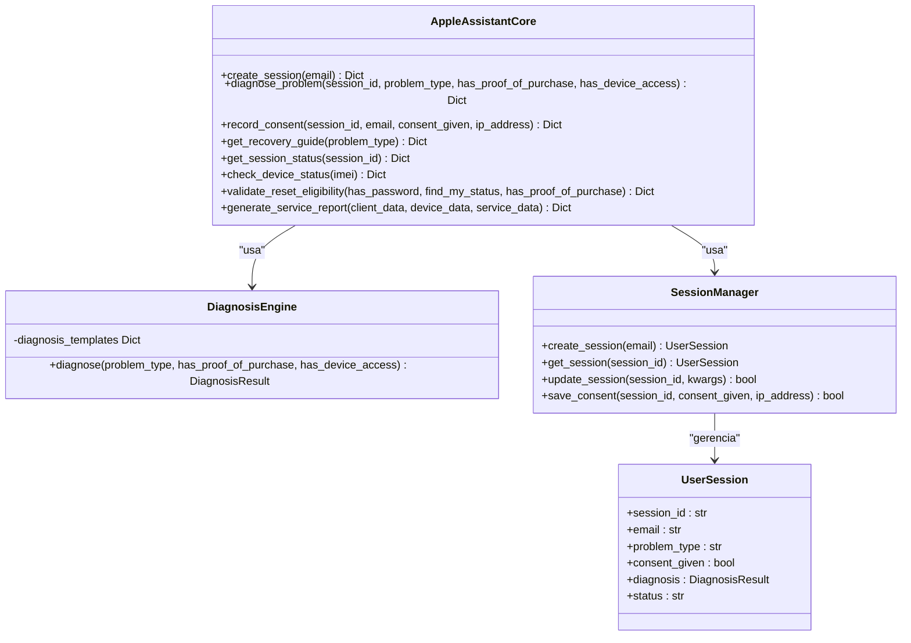
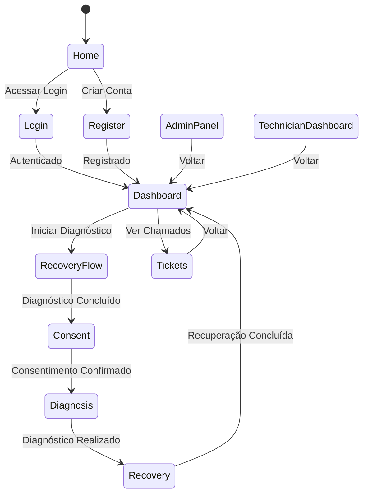
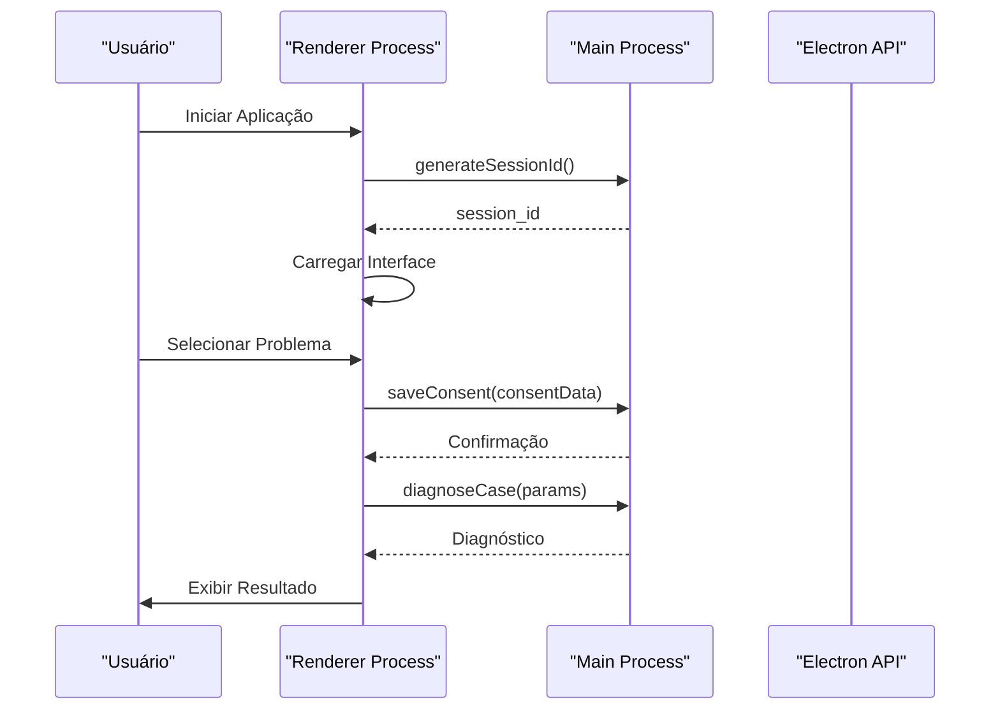
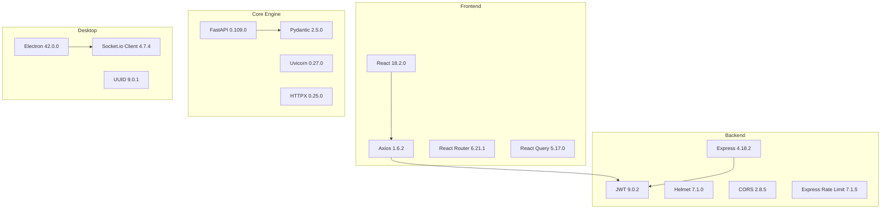

# Visão Geral da Arquitetura

<cite>
**Arquivo referenciados nesta documentação**
- [README.md](file://README.md)
- [backend/src/app.js](file://backend/src/app.js)
- [backend/src/routes/auth.js](file://backend/src/routes/auth.js)
- [backend/src/routes/diagnosis.js](file://backend/src/routes/diagnosis.js)
- [backend/package.json](file://backend/package.json)
- [core-engine/bridge/api.py](file://core-engine/bridge/api.py)
- [core-engine/python/main.py](file://core-engine/python/main.py)
- [core-engine/python/requirements.txt](file://core-engine/python/requirements.txt)
- [frontend/src/App.js](file://frontend/src/App.js)
- [frontend/src/services/api.js](file://frontend/src/services/api.js)
- [frontend/package.json](file://frontend/package.json)
- [desktop/electron-app/main.js](file://desktop/electron-app/main.js)
- [desktop/electron-app/renderer/app.js](file://desktop/electron-app/renderer/app.js)
- [desktop/electron-app/package.json](file://desktop/electron-app/package.json)
- [database/schema.sql](file://database/schema.sql)
</cite>

## Sumário
1. [Introdução](#introdução)
2. [Estrutura do Projeto](#estrutura-do-projeto)
3. [Componentes Principais](#componentes-principais)
4. [Visão Geral da Arquitetura](#visão-geral-da-arquitetura)
5. [Análise Detalhada dos Componentes](#análise-detalhada-dos-componentes)
6. [Análise de Dependências](#análise-de-dependências)
7. [Considerações de Desempenho](#considerações-de-desempenho)
8. [Guia de Solução de Problemas](#guia-de-solução-de-problemas)
9. [Conclusão](#conclusão)

## Introdução
O Bay-RSET Tool é um assistente guiado para recuperação de contas Apple ID, composto por quatro camadas principais:
- Frontend React: Interface web para usuários finais
- Backend Node.js: API REST com autenticação e roteamento
- Core Engine Python: Motor de diagnóstico e lógica de negócio
- Aplicativo Desktop Electron: Aplicação desktop com fluxo guiado

O sistema segue processos oficiais da Apple, com foco em segurança, conformidade legal e experiência do usuário.

## Estrutura do Projeto
O projeto segue uma arquitetura de microsserviços com comunicação assíncrona e segurança robusta:

**Fontes da figura**
- [README.md:19-29](file://README.md#L19-L29)
- [backend/src/app.js:15-32](file://backend/src/app.js#L15-L32)
- [core-engine/bridge/api.py:164-170](file://core-engine/bridge/api.py#L164-L170)

**Fontes da seção**
- [README.md:19-29](file://README.md#L19-L29)
- [README.md:89-95](file://README.md#L89-L95)

## Componentes Principais
O sistema é composto pelos seguintes componentes principais:

### Backend API (Node.js + Express)
- **Responsabilidades**: Autenticação JWT, roteamento REST, integração com Core Engine, segurança e logging
- **Características**: Middleware de segurança, rate limiting, CORS configurável e logging estruturado
- **Porta padrão**: 3000

### Core Engine (Python + FastAPI)
- **Responsabilidades**: Diagnóstico de problemas, geração de guias de recuperação, gestão de sessões
- **Características**: Modelagem de dados com Pydantic, WebSocket para comunicação em tempo real, validação de IMEI
- **Porta padrão**: 8000

### Frontend React
- **Responsabilidades**: Interface de usuário, navegação, integração com API e gerenciamento de estado
- **Características**: React Query para caching, Toast notifications, rotas protegidas e componentes reutilizáveis

### Desktop Electron
- **Responsabilidades**: Fluxo guiado offline, IPC com backend, navegação segura e atualizações automáticas
- **Características**: Segurança de navegação, permissões restritas e logging local

**Fontes da seção**
- [backend/src/app.js:15-54](file://backend/src/app.js#L15-L54)
- [core-engine/bridge/api.py:164-170](file://core-engine/bridge/api.py#L164-L170)
- [frontend/src/App.js:42-125](file://frontend/src/App.js#L42-L125)
- [desktop/electron-app/main.js:14-20](file://desktop/electron-app/main.js#L14-L20)

## Visão Geral da Arquitetura
A arquitetura segue o padrão de microsserviços com comunicação assíncrona e separação clara de responsabilidades:

**Fontes da figura**
- [backend/src/routes/diagnosis.js:42-69](file://backend/src/routes/diagnosis.js#L42-L69)
- [core-engine/bridge/api.py:251-283](file://core-engine/bridge/api.py#L251-L283)

### Camadas de Segurança
O sistema implementa múltiplas camadas de segurança:

**Fontes da figura**
- [backend/src/app.js:59-70](file://backend/src/app.js#L59-L70)
- [backend/src/routes/auth.js:25-42](file://backend/src/routes/auth.js#L25-L42)
- [core-engine/bridge/api.py:285-318](file://core-engine/bridge/api.py#L285-L318)

**Fontes da seção**
- [backend/src/app.js:59-88](file://backend/src/app.js#L59-L88)
- [backend/src/routes/auth.js:25-42](file://backend/src/routes/auth.js#L25-L42)
- [README.md:81-87](file://README.md#L81-L87)

## Análise Detalhada dos Componentes

### Backend API - Autenticação
O sistema de autenticação implementa um fluxo completo de login, registro e gestão de tokens:

**Fontes da figura**
- [backend/src/routes/auth.js:97-143](file://backend/src/routes/auth.js#L97-L143)

**Fontes da seção**
- [backend/src/routes/auth.js:44-95](file://backend/src/routes/auth.js#L44-L95)
- [backend/src/routes/auth.js:145-181](file://backend/src/routes/auth.js#L145-L181)

### Core Engine - Diagnóstico de Casos
O Core Engine implementa um motor de diagnóstico com diferentes tipos de problemas:

**Fontes da figura**
- [core-engine/python/main.py:263-460](file://core-engine/python/main.py#L263-L460)
- [core-engine/python/main.py:76-213](file://core-engine/python/main.py#L76-L213)
- [core-engine/python/main.py:215-261](file://core-engine/python/main.py#L215-L261)

**Fontes da seção**
- [core-engine/python/main.py:76-213](file://core-engine/python/main.py#L76-L213)
- [core-engine/python/main.py:215-261](file://core-engine/python/main.py#L215-L261)

### Frontend React - Navegação e Estados
O frontend implementa um sistema de navegação com estados gerenciados:

**Fontes da figura**
- [frontend/src/App.js:49-108](file://frontend/src/App.js#L49-L108)

**Fontes da seção**
- [frontend/src/App.js:42-125](file://frontend/src/App.js#L42-L125)
- [frontend/src/services/api.js:42-127](file://frontend/src/services/api.js#L42-L127)

### Desktop Electron - Fluxo Guiado
O desktop implementa um fluxo guiado com navegação restrita:

**Fontes da figura**
- [desktop/electron-app/renderer/app.js:245-280](file://desktop/electron-app/renderer/app.js#L245-L280)
- [desktop/electron-app/main.js:145-158](file://desktop/electron-app/main.js#L145-L158)

**Fontes da seção**
- [desktop/electron-app/renderer/app.js:19-40](file://desktop/electron-app/renderer/app.js#L19-L40)
- [desktop/electron-app/main.js:104-158](file://desktop/electron-app/main.js#L104-L158)

## Análise de Dependências
O sistema possui dependências bem definidas entre componentes:

**Fontes da figura**
- [frontend/package.json:14-24](file://frontend/package.json#L14-L24)
- [backend/package.json:23-46](file://backend/package.json#L23-L46)
- [core-engine/python/requirements.txt:4-26](file://core-engine/python/requirements.txt#L4-L26)
- [desktop/electron-app/package.json:22-33](file://desktop/electron-app/package.json#L22-L33)

**Fontes da seção**
- [frontend/package.json:1-59](file://frontend/package.json#L1-L59)
- [backend/package.json:1-59](file://backend/package.json#L1-L59)
- [core-engine/python/requirements.txt:1-27](file://core-engine/python/requirements.txt#L1-L27)
- [desktop/electron-app/package.json:1-73](file://desktop/electron-app/package.json#L1-L73)

## Considerações de Desempenho
O sistema foi projetado com várias considerações de performance:

### Escalabilidade Horizontal
- **Backend**: Pode ser escalado horizontalmente com balanceamento de carga
- **Core Engine**: Implementa WebSocket para comunicação em tempo real
- **Cache**: Redis opcional para caching de sessões e configurações

### Otimizações de Desempenho
- **Compression**: gzip para redução de tráfego
- **Rate Limiting**: Proteção contra ataques de força bruta
- **Connection Pooling**: Para conexões com banco de dados
- **Caching**: React Query para cache de dados do frontend

### Monitoramento e Logging
- **Winston**: Logging estruturado com níveis de severidade
- **Morgan**: Logging de requisições HTTP
- **Electron Log**: Logging específico para desktop
- **Health Checks**: Endpoints de verificação de integridade

**Fontes da seção**
- [backend/src/app.js:95-96](file://backend/src/app.js#L95-L96)
- [backend/src/app.js:34-54](file://backend/src/app.js#L34-L54)
- [README.md:81-87](file://README.md#L81-L87)

## Guia de Solução de Problemas
### Erros Comuns e Soluções

#### Erros de Autenticação
- **Credenciais Inválidas**: Verificar hash de senha e status da conta
- **Token Expirado**: Implementar refresh token
- **Conta Desativada**: Verificar status no banco de dados

#### Erros de Diagnóstico
- **Sessão Não Encontrada**: Verificar ID de sessão e tempo de expiração
- **Tipo de Problema Inválido**: Validar enumeração de tipos
- **Problemas de Conexão**: Verificar URL do Core Engine

#### Erros de Comunicação
- **CORS**: Configurar origens permitidas corretamente
- **Rate Limiting**: Implementar backoff exponential
- **Timeouts**: Ajustar timeouts nas requisições

**Fontes da seção**
- [backend/src/routes/auth.js:110-125](file://backend/src/routes/auth.js#L110-L125)
- [backend/src/routes/diagnosis.js:57-68](file://backend/src/routes/diagnosis.js#L57-L68)
- [core-engine/bridge/api.py:264-283](file://core-engine/bridge/api.py#L264-L283)

## Conclusão
O Bay-RSET Tool apresenta uma arquitetura sólida e bem estruturada que segue boas práticas de desenvolvimento moderno:

### Pontos Fortes
- **Separação Clara de Camadas**: Frontend, Backend, Core Engine e Desktop
- **Segurança Robusta**: Multi-layer de proteção e conformidade legal
- **Escalabilidade**: Design que permite crescimento horizontal
- **Experiência do Usuário**: Fluxos guiados e feedback imediato

### Recomendações para Melhorias
- **Documentação API**: Swagger/OpenAPI para todos os endpoints
- **Testes Automatizados**: Coverage para todas as camadas
- **Monitoramento APM**: Implementar tracing distribuído
- **CI/CD**: Pipeline automatizado para deploy contínuo

O sistema está pronto para atender a demanda de suporte técnico especializado em recuperação de contas Apple ID, mantendo a conformidade legal e oferecendo uma experiência de usuário excepcional.