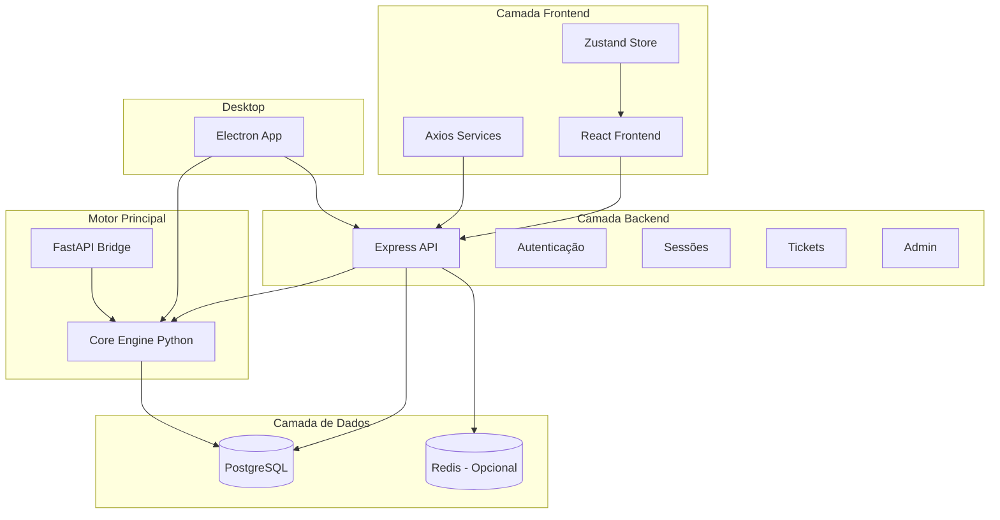
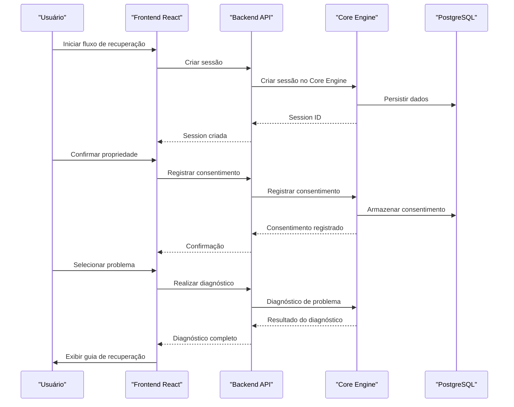
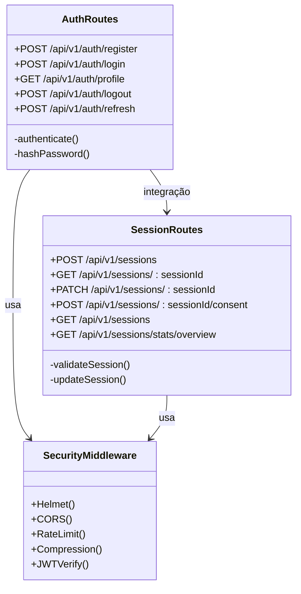
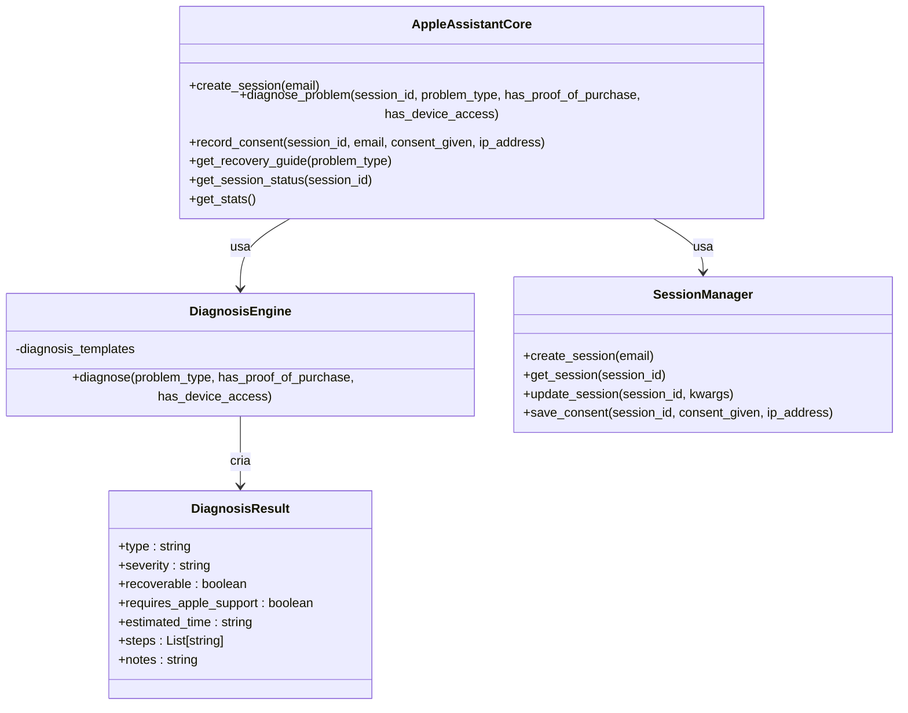
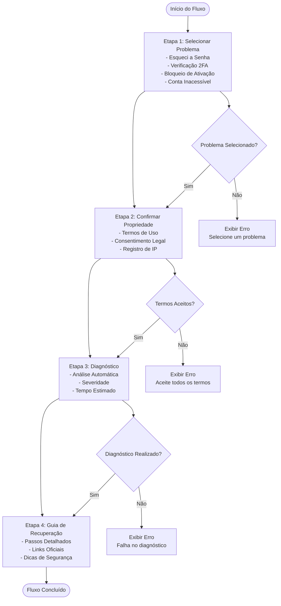
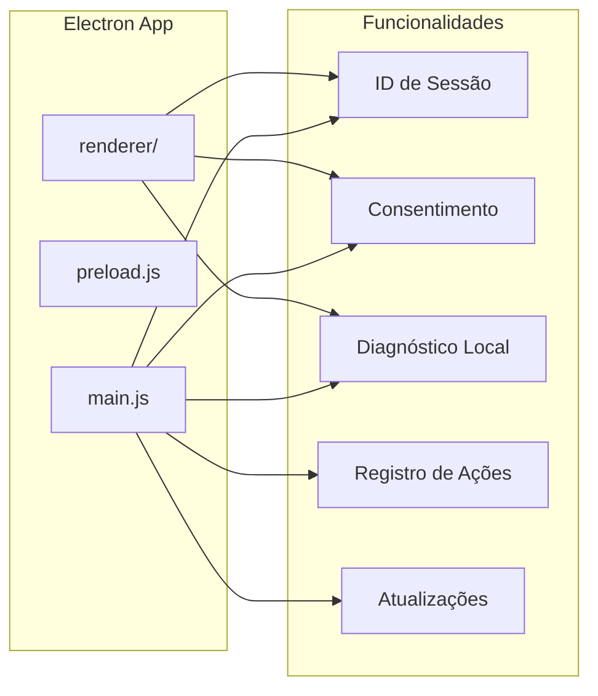
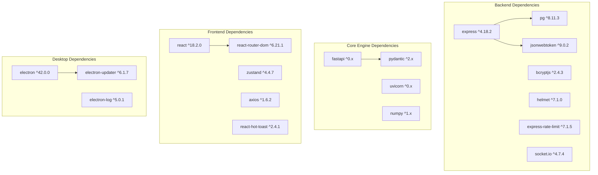

# Visão Geral do Projeto

<cite>
**Arquivo referenciados neste documento**
- [README.md](file://README.md)
- [backend/src/app.js](file://backend/src/app.js)
- [backend/package.json](file://backend/package.json)
- [backend/src/routes/auth.js](file://backend/src/routes/auth.js)
- [backend/src/routes/sessions.js](file://backend/src/routes/sessions.js)
- [core-engine/python/main.py](file://core-engine/python/main.py)
- [core-engine/bridge/api.py](file://core-engine/bridge/api.py)
- [database/schema.sql](file://database/schema.sql)
- [frontend/src/App.js](file://frontend/src/App.js)
- [frontend/src/pages/RecoveryFlow.js](file://frontend/src/pages/RecoveryFlow.js)
- [frontend/src/services/api.js](file://frontend/src/services/api.js)
- [frontend/src/store/useStore.js](file://frontend/src/store/useStore.js)
- [desktop/electron-app/main.js](file://desktop/electron-app/main.js)
- [desktop/electron-app/package.json](file://desktop/electron-app/package.json)
</cite>

## Sumário
1. [Introdução](#introdução)
2. [Estrutura do Projeto](#estrutura-do-projeto)
3. [Componentes Principais](#componentes-principais)
4. [Visão Geral da Arquitetura](#visão-geral-da-arquitetura)
5. [Análise Detalhada dos Componentes](#análise-detalhada-dos-componentes)
6. [Análise de Dependências](#análise-de-dependências)
7. [Considerações de Desempenho](#considerações-de-desempenho)
8. [Guia de Solução de Problemas](#guia-de-solução-de-problemas)
9. [Conclusão](#conclusão)

## Introdução
O Bay-RSET Tool é um assistente profissional de recuperação de contas Apple ID que segue rigorosamente os processos oficiais da Apple. O sistema oferece um fluxo guiado para recuperação de senhas, verificação em duas etapas, bloqueio de ativação, acompanhamento de solicitações e sistema completo de tickets de suporte. O projeto é composto por uma arquitetura de microserviços com backend Node.js, motor principal em Python, interface web React, e aplicativo desktop Electron.

## Estrutura do Projeto
O projeto segue uma estrutura de microserviços com os seguintes componentes principais:

**Fontes do diagrama**
- [README.md:19-29](file://README.md#L19-L29)
- [backend/src/app.js:98-117](file://backend/src/app.js#L98-L117)
- [core-engine/bridge/api.py:119-126](file://core-engine/bridge/api.py#L119-L126)

**Fontes da seção**
- [README.md:19-29](file://README.md#L19-L29)
- [backend/package.json:1-59](file://backend/package.json#L1-59)
- [desktop/electron-app/package.json:1-73](file://desktop/electron-app/package.json#L1-L73)

## Componentes Principais

### Backend (Node.js + Express)
O backend é uma API REST construída com Express que fornece:
- Autenticação de usuários com JWT
- Gestão de sessões de recuperação
- Integração com o Core Engine Python
- Sistema de tickets de suporte
- Middleware de segurança (Helmet, CORS, rate limiting)

### Core Engine (Python + FastAPI)
O motor principal do sistema escrito em Python com FastAPI:
- Diagnóstico automático de problemas de Apple ID
- Gerenciamento de sessões de usuário
- Geração de guias de recuperação
- Estatísticas do sistema
- WebSocket para comunicação em tempo real

### Frontend (React + TailwindCSS)
Interface web moderna com:
- Fluxo de recuperação guiado
- Dashboard de acompanhamento
- Sistema de tickets
- Autenticação e proteção de rotas
- Armazenamento local com Zustand

### Desktop App (Electron)
Aplicativo desktop com:
- Interface semelhante ao frontend
- Funcionalidades offline
- Atualização automática
- Segurança reforçada

**Fontes da seção**
- [backend/src/app.js:1-194](file://backend/src/app.js#L1-L194)
- [core-engine/python/main.py:246-450](file://core-engine/python/main.py#L246-L450)
- [frontend/src/App.js:1-93](file://frontend/src/App.js#L1-L93)
- [desktop/electron-app/main.js:1-324](file://desktop/electron-app/main.js#L1-L324)

## Visão Geral da Arquitetura

**Fontes do diagrama**
- [frontend/src/pages/RecoveryFlow.js:39-106](file://frontend/src/pages/RecoveryFlow.js#L39-L106)
- [backend/src/routes/sessions.js:56-87](file://backend/src/routes/sessions.js#L56-L87)
- [core-engine/bridge/api.py:168-186](file://core-engine/bridge/api.py#L168-L186)

**Fontes da seção**
- [README.md:73-80](file://README.md#L73-L80)
- [backend/src/app.js:98-134](file://backend/src/app.js#L98-L134)

## Análise Detalhada dos Componentes

### Backend API - Segurança e Autenticação

**Fontes do diagrama**
- [backend/src/routes/auth.js:25-42](file://backend/src/routes/auth.js#L25-L42)
- [backend/src/routes/sessions.js:19-37](file://backend/src/routes/sessions.js#L19-L37)
- [backend/src/app.js:59-96](file://backend/src/app.js#L59-L96)

O backend implementa múltiplas camadas de segurança:
- **Helmet.js**: Configurações avançadas de cabeçalhos de segurança
- **CORS**: Controle granular de origens permitidas
- **Rate Limiting**: Proteção contra ataques de força bruta
- **JWT**: Autenticação stateless com tokens
- **Validações**: Express Validator para todas as requisições

### Core Engine - Diagnóstico e Processamento

**Fontes do diagrama**
- [core-engine/python/main.py:246-450](file://core-engine/python/main.py#L246-L450)
- [core-engine/python/main.py:75-196](file://core-engine/python/main.py#L75-L196)
- [core-engine/python/main.py:198-244](file://core-engine/python/main.py#L198-L244)
- [core-engine/python/main.py:51-61](file://core-engine/python/main.py#L51-L61)

O Core Engine processa os fluxos de recuperação com base em templates pré-definidos para diferentes tipos de problemas:

**Tipos de Problemas Suportados:**
- **Esqueci a Senha**: Recuperação via iforgot.apple.com
- **Verificação em 2 Etapas**: Processo de verificação adicional
- **Bloqueio de Ativação**: Remoção de dispositivos iCloud
- **Conta Inacessível**: Processos de liberação de contas
- **Dispositivo Usado**: Casos de dispositivos comprados usados

### Frontend - Fluxo de Recuperação Guiado

**Fontes do fluxo**
- [frontend/src/pages/RecoveryFlow.js:18-67](file://frontend/src/pages/RecoveryFlow.js#L18-L67)
- [frontend/src/pages/RecoveryFlow.js:88-106](file://frontend/src/pages/RecoveryFlow.js#L88-L106)
- [frontend/src/pages/RecoveryFlow.js:219-272](file://frontend/src/pages/RecoveryFlow.js#L219-L272)

### Desktop App - Funcionalidades Offline

**Fontes do diagrama**
- [desktop/electron-app/main.js:104-228](file://desktop/electron-app/main.js#L104-L228)
- [desktop/electron-app/main.js:254-286](file://desktop/electron-app/main.js#L254-L286)

**Fontes da seção**
- [backend/src/routes/auth.js:1-183](file://backend/src/routes/auth.js#L1-L183)
- [backend/src/routes/sessions.js:1-249](file://backend/src/routes/sessions.js#L1-L249)
- [core-engine/python/main.py:1-499](file://core-engine/python/main.py#L1-L499)
- [frontend/src/pages/RecoveryFlow.js:1-517](file://frontend/src/pages/RecoveryFlow.js#L1-L517)
- [desktop/electron-app/main.js:1-324](file://desktop/electron-app/main.js#L1-L324)

## Análise de Dependências

**Fontes do diagrama**
- [backend/package.json:23-46](file://backend/package.json#L23-L46)
- [core-engine/python/requirements.txt](file://core-engine/python/requirements.txt)
- [frontend/package.json:5-25](file://frontend/package.json#L5-L25)
- [desktop/electron-app/package.json:27-33](file://desktop/electron-app/package.json#L27-L33)

**Fontes da seção**
- [backend/package.json:1-59](file://backend/package.json#L1-L59)
- [frontend/package.json:1-59](file://frontend/package.json#L1-L59)
- [desktop/electron-app/package.json:1-73](file://desktop/electron-app/package.json#L1-L73)

## Considerações de Desempenho

### Escalabilidade e Carga
- **Rate Limiting**: Configuração de 100 requisições por IP a cada 15 minutos
- **Compression**: Uso de gzip para reduzir tamanho de respostas
- **CORS**: Configuração otimizada para produção
- **WebSocket**: Comunicação em tempo real para atualizações dinâmicas

### Armazenamento de Dados
- **PostgreSQL**: Banco relacional com índices otimizados
- **Redis**: Cache opcional para sessões e tokens
- **UUID**: Identificadores únicos para todas as entidades
- **Triggers**: Atualização automática de timestamps

### Segurança e Conformidade
- **Criptografia**: Bcrypt para senhas, JWT para autenticação
- **Auditoria**: Logs completos de todas as ações
- **Consentimento**: Registro legal de propriedade
- **Headers de Segurança**: CSP, X-Frame-Options, X-Content-Type-Options

## Guia de Solução de Problemas

### Erros Comuns e Soluções

**Problema**: Erro 401 - Token Inválido
- **Causa**: Token expirado ou mal formado
- **Solução**: Fazer refresh token ou login novamente
- **Implementação**: Interceptor de resposta trata automaticamente

**Problema**: Erro 403 - Acesso Negado
- **Causa**: Permissões insuficientes
- **Solução**: Verificar papel de usuário (user/support/admin)
- **Implementação**: Rotas protegidas com middleware de autenticação

**Problema**: Erro 500 - Falha no Diagnóstico
- **Causa**: Problema no Core Engine
- **Solução**: Verificar status do Core Engine e logs
- **Implementação**: Tratamento de exceções centralizado

**Problema**: Erro 429 - Muitas Requisições
- **Causa**: Limite de rate limiting atingido
- **Solução**: Aguardar 15 minutos ou reduzir requisições
- **Implementação**: Rate limiter configurado

**Fontes da seção**
- [frontend/src/services/api.js:29-40](file://frontend/src/services/api.js#L29-L40)
- [backend/src/routes/auth.js:25-42](file://backend/src/routes/auth.js#L25-L42)
- [core-engine/bridge/api.py:404-414](file://core-engine/bridge/api.py#L404-L414)

## Conclusão

O Bay-RSET Tool representa uma solução completa e robusta para recuperação de contas Apple ID, seguindo rigorosamente os processos oficiais da Apple. A arquitetura de microserviços permite escalabilidade, manutenibilidade e conformidade com as melhores práticas de desenvolvimento.

**Principais Diferenciais:**
- **Conformidade Legal**: Todos os processos seguem procedimentos oficiais da Apple
- **Segurança Avançada**: Camadas múltiplas de proteção e auditoria
- **Experiência do Usuário**: Fluxo guiado intuitivo e responsivo
- **Arquitetura Modular**: Microserviços independentes e escaláveis
- **Documentação Completa**: APIs com documentação automática e exemplos práticos

O sistema está preparado para atender tanto usuários finais quanto equipes de suporte, com capacidade de acompanhamento em tempo real e geração de relatórios detalhados.